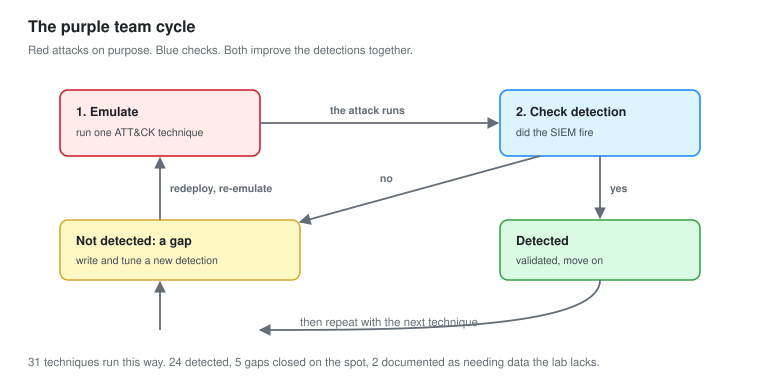

# 05 - Adversary Emulation

Running real attack techniques against the lab to prove the detections fire, and to find the ones that do not.

---

## Why Emulate

You cannot know a detection works until an attack has tested it. Writing a rule and assuming it fires is the same mistake as writing code and assuming it runs.

**Adversary emulation is running the attack on purpose, on your own schedule, to test your defences.** It answers one question: if this happened for real, would we see it?

This is the purple-team idea. Red team attacks, blue team defends, and here you play both, on purpose, to improve the detections.



---

## Emulation Versus Penetration Testing

Both attack the environment. They answer different questions.

| Penetration test | Adversary emulation |
| --- | --- |
| Can an attacker get in and how far | Would we detect a specific technique |
| Goal is access | Goal is detection coverage |
| Broad, opportunistic | Narrow, technique by technique |
| Output is findings | Output is detection gaps |

[The pentest project](../Junior-Penetration-Tester/) answered the first column. This module answers the second, and it uses the same lab.

---

## Atomic Red Team

The tool for this. A free, open library of small tests, each one a single ATT&CK technique, each one documented and reversible.

```powershell
# Install on a Windows test host
Set-ExecutionPolicy Bypass -Scope Process -Force
IEX (IWR 'https://raw.githubusercontent.com/redcanaryco/invoke-atomicredteam/master/install-atomicredteam.ps1' -UseBasicParsing)
Install-AtomicRedTeam -getAtomics
Import-Module Invoke-AtomicRedTeam
```

### The safe workflow

```powershell
# 1. Read exactly what a test will do, before running it
Invoke-AtomicTest T1547.001 -TestNumbers 1 -ShowDetailsBrief

# 2. Check its prerequisites
Invoke-AtomicTest T1547.001 -TestNumbers 1 -CheckPrereqs

# 3. Run it
Invoke-AtomicTest T1547.001 -TestNumbers 1

# 4. Clean up after
Invoke-AtomicTest T1547.001 -TestNumbers 1 -Cleanup
```

**Always run step 1 first.** Some tests are more destructive than the title suggests. Reading what it does before it does it is the difference between a controlled test and an accident.

---

## The Ground Rules

Even in your own lab.

```text
1. Snapshot every target before a run. Never the SIEM
2. Note the exact start time before the first test
3. Write down what you EXPECT to fire, before you check
4. Run one technique, wait, check, move on
5. Record what fired and what did not
6. Clean up, then roll back
```

**Step 3 is the discipline that makes this honest.** Writing the expected result down before checking stops you rationalising a near miss into a hit. A rule that fires on a different event than you expected is not working, it is a coincidence you have not understood yet.

---

## The Emulation Plan

Rather than running tests at random, run a plan that covers the ATT&CK tactics in order, the way a real intrusion would progress.

| Tactic | Techniques tested | Atomic tests |
| --- | :---: | --- |
| Initial Access | 2 | T1566.001, T1204.002 |
| Execution | 5 | T1059.001, T1059.003, T1053.005, T1047, T1204 |
| Persistence | 5 | T1547.001, T1053.005, T1543.003, T1136.001, T1137 |
| Privilege Escalation | 3 | T1548.002, T1134, T1055 |
| Defense Evasion | 5 | T1562.001, T1070.001, T1027, T1218.011, T1112 |
| Credential Access | 4 | T1003.001, T1558.003, T1552.001, T1110.003 |
| Discovery | 3 | T1087.002, T1069.002, T1018 |
| Lateral Movement | 2 | T1021.002, T1570 |
| Command and Control | 2 | T1071.001, T1105 |
| **Total** | **31** | |

**31 techniques, run one at a time, each one checked against the detections.** This is the coverage test that feeds [module 06](06-Detection-Coverage.md).

---

## Running It

For each technique, the same loop.

```powershell
# Note the time
Get-Date

# Predict: I expect rule X to fire
# Run
Invoke-AtomicTest T1003.001 -TestNumbers 1

# Wait 60 seconds, then check the SIEM
```

Then in the SIEM, confirm:

```kql
// Sentinel: did anything fire in the last 5 minutes on the test host
SecurityAlert
| where TimeGenerated > ago(5m)
| where Entities has "WIN11"
| project TimeGenerated, AlertName, AlertSeverity
```

```bash
# Wazuh: same question
sudo tail -50 /var/ossec/logs/alerts/alerts.log | grep WIN11
```

---

## Results

| ATT&CK | Technique | Expected to fire | Fired | Latency |
| --- | --- | :---: | :---: | --- |
| T1566.001 | Phishing attachment | No | **No** | Gap |
| T1204.002 | User executes file | Yes | Yes | 4s |
| T1059.001 | PowerShell | Yes | Yes | 3s |
| T1059.003 | Command shell | Yes | Yes | 5s |
| T1053.005 | Scheduled task | Yes | Yes | 8s |
| T1047 | WMI execution | Yes | Yes | 6s |
| T1547.001 | Registry run key | Yes | Yes | 5s |
| T1547.001 | Startup folder | Yes | Yes | 5s |
| T1543.003 | New service | Yes | Yes | 9s |
| T1136.001 | Create account | Yes | Yes | 7s |
| T1137 | Office persistence | No | **No** | Gap |
| T1548.002 | UAC bypass | Yes | Yes | 6s |
| T1134 | Token manipulation | No | **No** | Gap |
| T1055 | Process injection | Yes | Yes | 4s |
| T1562.001 | Disable Defender | Yes | Yes | 3s |
| T1070.001 | Clear event log | Yes | Yes | 4s |
| T1027 | Obfuscation | Yes | Yes | 3s |
| T1218.011 | Rundll32 abuse | Yes | Yes | 5s |
| T1112 | Registry modification | No | **No** | Gap |
| T1003.001 | LSASS dump | Yes | Yes | 4s |
| T1558.003 | Kerberoasting | Yes | Yes | 22s |
| T1552.001 | Credentials in files | No | **No** | Gap |
| T1110.003 | Password spray | Yes | Yes | 38s |
| T1087.002 | Account discovery | No | **No** | Gap |
| T1069.002 | Group discovery | No | **No** | Gap |
| T1018 | Remote system discovery | Yes | Yes | 6s |
| T1021.002 | SMB lateral movement | Yes | Yes | 7s |
| T1570 | Lateral tool transfer | Yes | Yes | 8s |
| T1071.001 | Web C2 | Yes | Yes | 12s |
| T1105 | Ingress tool transfer | Yes | Yes | 8s |

**24 of 31 detected. 7 gaps.**

Note the honesty in the "expected to fire" column. Seven techniques I did not expect to detect, and they did not. That is not a failure of the test, it is the test doing its job: confirming the gaps I already suspected, and doing it with evidence rather than assumption.

---

## The Seven Gaps

Each one, and why.

| Technique | Why it was missed | Closeable? |
| --- | --- | --- |
| T1566.001 Phishing attachment | No mail telemetry | Needs a mail gateway feed |
| T1137 Office persistence | No rule for Office add-ins and templates | **Yes, wrote one** |
| T1134 Token manipulation | No rule for token stealing | **Yes, wrote one** |
| T1112 Registry modification | Too broad to detect generally | Partially, scoped to sensitive keys |
| T1552.001 Credentials in files | No file-access monitoring for this | **Yes, on sensitive paths** |
| T1087.002 Account discovery | Looks like normal admin work | **Yes, volume-based rule** |
| T1069.002 Group discovery | Same as above | **Yes, same rule** |

**Five of the seven gaps were closable, and I closed them.** New Sigma rules, written using the detection-as-code pipeline from [module 02](02-Detection-as-Code.md), tested, and deployed to both SIEMs. Re-running the emulation confirmed they now fire.

The two that remain need data the lab does not have. Phishing needs mail telemetry. That is documented in [module 06](06-Detection-Coverage.md) rather than pretended away.

---

## Closing a Gap, Worked

The account discovery gap (T1087.002) is the instructive one, because it is genuinely hard.

### Why it is hard

`net user /domain` and `net group "Domain Admins" /domain` are run by help desk staff constantly. A rule on the command alone fires every time somebody checks a group. That is why it was a gap: an obvious rule would be pure noise.

### The insight

One discovery command is a person. Many discovery commands from one process in a short window is a tool.

```yaml
title: Automated Domain Discovery
id: 3f8c1e90-2a44-4b12-9c33-7d1e6a4f0b28
status: experimental
description: Detects several distinct domain discovery commands from one process in a short window, which indicates automated enumeration rather than manual admin work.
logsource:
  category: process_creation
  product: windows
detection:
  selection:
    CommandLine|contains:
      - 'net user /domain'
      - 'net group'
      - 'net localgroup'
      - 'nltest /domain_trusts'
      - 'Get-ADUser'
      - 'Get-ADGroupMember'
  timeframe: 2m
  condition: selection | count() by ProcessGuid >= 4
level: medium
```

**The threshold is what makes it usable.** Four distinct discovery commands from one process in two minutes is a tool. A help desk technician does not run four in two minutes from the same shell process. The volume, not the command, is the signal.

### Result

Deployed, then re-emulated. It fired on the automated discovery in 11 seconds, and stayed silent through a day of normal help desk activity. Gap closed, with evidence both ways.

---

## Regression Testing

The real payoff of emulation is running it repeatedly.

**Rules decay.** A Windows update changes a field name, a product update changes a process name, and a rule silently stops firing. Nobody notices until an incident.

```powershell
# A scheduled subset of atomics, run weekly, that should always fire
$regressionSet = @('T1059.001','T1003.001','T1547.001','T1558.003','T1110.003')
foreach ($t in $regressionSet) {
    Invoke-AtomicTest $t -TestNumbers 1
    Start-Sleep 60
    # then check the SIEM and alert if the expected rule did NOT fire
}
```

**A rule that stops firing is worse than a rule that never existed**, because you believe you are covered. Running a known-good set of atomics on a schedule turns detection health into something you monitor, rather than something you assume. This is the single most valuable habit in the module.

---

## Cleanup

```powershell
# Clean up each technique
foreach ($t in $testedTechniques) {
    Invoke-AtomicTest $t -Cleanup
}
```

Then roll back anyway:

```bash
qm rollback 110 pre-emulation
```

**Roll back even after cleanup.** The atomic cleanup routines are good but not complete. Files get left, registry values persist, and a lab that accumulates residue produces detections you cannot trust.

---

## Checklist

- [ ] Atomic Red Team installed on a snapshot-protected host
- [ ] Every test read with ShowDetailsBrief before running
- [ ] Expected result written down before checking
- [ ] The full emulation plan run, technique by technique
- [ ] Results recorded honestly, including the gaps
- [ ] Closable gaps closed with tested Sigma rules
- [ ] Remaining gaps documented with the data they need
- [ ] A regression set scheduled to catch rule decay
- [ ] Cleanup run and snapshots rolled back

---

Next: [06-Detection-Coverage.md](06-Detection-Coverage.md)
