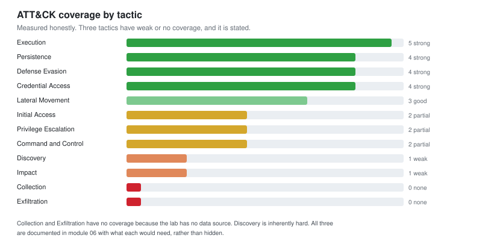
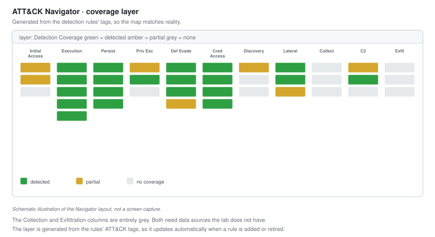

# 06 - Detection Coverage

Mapping every detection to MITRE ATT&CK, finding the holes honestly, and deciding what to fix first.

---

## Why Measure Coverage

You cannot improve what you cannot see. A pile of 24 detections feels like good coverage until you map them and find that eleven of them cover Execution and none cover Exfiltration.

**Coverage mapping turns "we have lots of rules" into "here is exactly what we can and cannot catch."** That is the difference between a feeling and a plan.

---

## The Map



Every detection, placed against the tactic it covers.

| Tactic | Detections | Coverage | Notes |
| --- | :---: | --- | --- |
| Initial Access | 2 | Partial | Detected at execution, not delivery |
| Execution | 5 | Strong | The best-covered tactic |
| Persistence | 4 | Strong | Registry, tasks, services, startup |
| Privilege Escalation | 2 | Partial | UAC bypass and injection only |
| Defense Evasion | 4 | Strong | Defender tampering, log clearing, obfuscation |
| Credential Access | 4 | Strong | LSASS, Kerberoasting, spraying, files |
| Discovery | 1 | Weak | Only the volume-based rule from module 05 |
| Lateral Movement | 3 | Good | SMB, remote services, tool transfer |
| Collection | 0 | **None** | No data source |
| Command and Control | 2 | Partial | Beaconing and ingress transfer |
| Exfiltration | 0 | **None** | No data source |
| Impact | 1 | Weak | Ransomware behaviour only |

**Three tactics stand out: Discovery is weak, and Collection and Exfiltration have nothing.** Naming that plainly is the point of this module. A coverage report that shows all green is a coverage report nobody checked.

---

## The ATT&CK Navigator

The standard tool for this. A free web application that renders the ATT&CK matrix as a heatmap you colour by your coverage.



*Schematic illustration of the Navigator layout, not a screen capture.*

### Generating the layer from the rules

Because the detections are code with ATT&CK tags ([module 02](02-Detection-as-Code.md)), the coverage layer can be generated automatically from them.

```python
# Read every rule's ATT&CK tags and build a Navigator layer
import yaml, json, glob

techniques = {}
for path in glob.glob("rules/**/*.yml", recursive=True):
    rule = yaml.safe_load(open(path))
    for tag in rule.get("tags", []):
        if tag.startswith("attack.t"):
            tid = tag.replace("attack.t", "T").upper()
            techniques[tid] = techniques.get(tid, 0) + 1

layer = {
    "name": "Detection Coverage",
    "versions": {"navigator": "4.9", "attack": "15"},
    "domain": "enterprise-attack",
    "techniques": [
        {"techniqueID": t, "score": min(c * 25, 100),
         "comment": f"{c} detection(s)"}
        for t, c in techniques.items()
    ],
    "gradient": {"colors": ["#ffdcd8", "#dafbe1"], "minValue": 0, "maxValue": 100}
}
json.dump(layer, open("coverage-layer.json", "w"), indent=2)
```

**Generating the layer from the rules keeps it honest.** A hand-drawn coverage map shows what you think you cover. A generated one shows what your rules actually tag. When a rule is retired, the map updates. There is no gap between the claim and the reality.

---

## Reading the Gaps

A gap is not automatically a failure. There are three kinds, and they need different responses.

| Gap type | Meaning | Response |
| --- | --- | --- |
| **Fixable now** | We have the data, no rule exists | Write the rule |
| **Data gap** | No log source to build on | Get the data, or accept the gap |
| **Inherent** | The technique looks like normal activity | Accept, or use volume and correlation |

### Discovery: an inherent gap, partly closed

Discovery is weak because enumeration commands look like administration. The volume-based rule from [module 05](05-Adversary-Emulation.md) closes part of it, catching automated enumeration by counting distinct commands per process. Manual, patient discovery still slips through, and that is an accepted residual risk rather than a fixable gap.

### Collection and Exfiltration: data gaps

These have no coverage because the data does not exist. Detecting collection needs file-access auditing at scale. Detecting exfiltration needs proxy logs, egress inspection, or data-loss tooling. The lab has none of these.

**This is documented, not hidden.** The response is a recommendation: to cover these tactics, add these data sources. That recommendation is worth more to a real program than a fake detection would be.

---

## The Gap Register

Every gap, tracked like a finding.

| ID | Gap | Tactic | Type | Status |
| --- | --- | --- | --- | --- |
| G-01 | Phishing at delivery | Initial Access | Data gap | Open, needs mail telemetry |
| G-02 | Office add-in persistence | Persistence | Fixable | **Closed** |
| G-03 | Token manipulation | Priv Esc | Fixable | **Closed** |
| G-04 | Credentials in files | Credential Access | Fixable | **Closed** |
| G-05 | Account and group discovery | Discovery | Inherent | **Partly closed** |
| G-06 | Data collection | Collection | Data gap | Open, needs file auditing |
| G-07 | Exfiltration | Exfiltration | Data gap | Open, needs egress logs |

**Five closed or partly closed, three open, all named.** The three open ones are all data gaps or inherent limits, not things I could have fixed and did not. That distinction is what a hiring manager is looking for: can this person tell the difference between a gap they should have closed and one they genuinely could not.

---

## Prioritising What to Fix

Not all gaps are equal. Prioritise by two questions: how likely is the technique, and how bad if it succeeds.

```text
High likelihood + high impact   ->  fix first
High likelihood + low impact    ->  fix next
Low likelihood + high impact    ->  monitor, plan
Low likelihood + low impact     ->  accept
```

Applied to the open gaps:

| Gap | Likelihood | Impact | Priority |
| --- | --- | --- | --- |
| G-01 Phishing delivery | High | High | **First.** Most attacks start here |
| G-07 Exfiltration | Medium | High | Second. The point of most attacks |
| G-06 Collection | Medium | Medium | Third |

**G-01 is first because most real intrusions start with phishing.** A gap at the very start of the attack chain matters more than one deeper in, because catching it early stops everything downstream. This is the same lesson as the SOC incident reports: the earliest detection is the most valuable.

---

## Coverage Is Not the Goal

An important caveat, because coverage numbers are easy to game.

**100 percent coverage does not mean you are safe.** A tactic can be marked "covered" by a rule that has silently stopped firing, or by a rule so noisy nobody reads its alerts. Coverage counts rules that exist, not detections that work.

Two things keep coverage honest:

- **The regression testing from [module 05](05-Adversary-Emulation.md)**, which proves the rules still fire
- **The false-positive tracking from [module 09](09-Metrics-and-Maturity.md)**, which proves the alerts still get read

**A green coverage map plus a passing regression suite plus a workable false-positive rate is real coverage.** Any one of them alone is a number that can lie.

---

## Checklist

- [ ] Every detection mapped to an ATT&CK technique
- [ ] The coverage layer generated from the rules, not drawn by hand
- [ ] Gaps categorised as fixable, data, or inherent
- [ ] A gap register maintained like a findings list
- [ ] Fixable gaps closed with tested rules
- [ ] Data and inherent gaps documented with what they need
- [ ] Gaps prioritised by likelihood and impact
- [ ] Coverage cross-checked against regression tests, not trusted alone

---

Next: [07-Malware-Triage.md](07-Malware-Triage.md)
