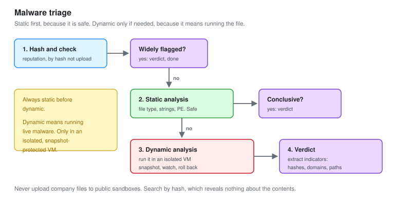

# 07 - Malware Triage

Working out what a suspicious file is, safely, when a Tier 1 escalation lands on your desk.

---

## The Scope of This

This is triage, not reverse engineering. Full malware analysis is a specialism of its own. What a Tier 2 analyst needs is enough to answer three questions quickly:

```text
1. Is this file malicious?
2. What does it do, roughly?
3. What indicators should we block and hunt for?
```

That is achievable in an hour with free tools and a safe environment. Deep reverse engineering is escalated further.

---

## Safety First, Always

Malware is live ammunition. Handle it like it.

```text
1. Analyse only in an isolated VM, never your real machine
2. That VM has NO network access to anything you care about
3. Snapshot before, roll back after. Every time
4. Never run an unknown file on a domain-joined machine
5. Never upload a company file to a public sandbox (it leaks the contents)
6. Handle samples in a password-protected zip so tools do not auto-run them
```

**Rule 5 is the one people get wrong under pressure.** Uploading a suspicious invoice to VirusTotal to check it also uploads whatever was inside the invoice, where other subscribers can download it. Search by hash instead, which reveals nothing about the contents.

### The analysis VM

```text
A dedicated Windows VM, isolated on its own network with no route out
FLARE-VM installed (a free malware analysis toolset)
Snapshot named "clean" to roll back to after every sample
```

---

## The Triage Flow



Static analysis first, because it is safe. Dynamic only if static is inconclusive, because dynamic means running it.

```text
Hash it  ->  reputation check  ->  static analysis  ->  (if needed) dynamic  ->  verdict
```

---

## Static Analysis

Learning what you can without running the file. Always start here.

### Hash and reputation

```powershell
Get-FileHash -Algorithm SHA256 sample.bin
```

```bash
# Search the hash, do not upload the file
# On VirusTotal, AbuseIPDB, or your threat intel platform
```

| Result | Means |
| --- | --- |
| Widely flagged | Known malware. You have your answer |
| A few flags | Suspicious, possibly a false positive, keep going |
| Zero results | Unknown. Not safe. New malware is always zero at first |

**Zero detections does not mean clean.** Every piece of malware was zero once. Unknown means keep analysing, not stop.

### File type

```bash
# What is it really, regardless of extension
file sample.bin
```

A file named `invoice.pdf` that `file` reports as a Windows executable is the whole answer. Extension lies. The header does not.

### Strings

```bash
# Human-readable text inside the file
strings -n 8 sample.bin | less

# On Windows, with FLARE-VM
strings64.exe -n 8 sample.bin
```

Look for:

| String type | Means |
| --- | --- |
| URLs and IP addresses | Command and control, or download sources |
| Registry keys | Persistence locations |
| File paths | Where it drops things |
| Suspicious API names | `VirtualAlloc`, `CreateRemoteThread`, `WriteProcessMemory` mean injection |
| Base64 blobs | Hidden payloads. Decode them |
| Command lines | What it runs |

**Strings alone often answers "roughly what does it do."** A file containing a hardcoded IP, a Run key path, and `CreateRemoteThread` is a downloader that persists and injects, and you knew that without running it.

### PE analysis

For a Windows executable, the structure tells you more.

```bash
# Imports, sections, compile time
pecheck sample.bin        # or pestudio on FLARE-VM
```

| Signal | Means |
| --- | --- |
| Very few imports | Often packed, hiding its real behaviour |
| A section named UPX | Packed with UPX, unpack it first |
| High entropy sections | Encrypted or compressed content |
| A recent compile time | Freshly built, likely targeted |
| Network and crypto APIs together | Downloads and encrypts. Possible ransomware |

**Few imports plus high entropy means packed.** A packed file hides its real imports and strings until it runs. That is a strong signal on its own, and it usually pushes you to dynamic analysis.

---

## Dynamic Analysis

Running the file, in the isolated VM, and watching what it does. Only after static analysis, and only with a snapshot to roll back to.

### The setup

```text
1. Roll the analysis VM to its clean snapshot
2. Start the monitoring tools BEFORE running the sample
3. Run the sample
4. Watch for 2 to 5 minutes
5. Collect the evidence
6. Roll back
```

### The monitoring tools

| Tool | Watches |
| --- | --- |
| Process Monitor (procmon) | Every file, registry and process action |
| Process Hacker | Running processes, injected threads |
| Wireshark or a fake network | What it tries to connect to |
| Regshot | Registry before and after, the difference |
| FakeNet-NG | Answers the malware's network calls so it reveals its C2 |

**FakeNet is the clever one.** Malware often does nothing useful if it cannot reach its command server. FakeNet pretends to be the whole internet and answers every request, so the malware happily reveals the domains and commands it wanted, all without any real network access.

### What to record

```text
Processes it created           (and what they were)
Files it wrote                 (and where)
Registry keys it changed       (persistence)
Network connections attempted  (C2 indicators)
Whether it injected into anything
Whether it tried to disable security tools
```

### Automated sandboxes

For speed, an automated sandbox does the dynamic run for you and writes a report.

| Sandbox | Note |
| --- | --- |
| Any.run | Interactive, free tier, you watch it live |
| Hybrid Analysis | Free, thorough report |
| Cuckoo / CAPE | Self-hosted, for samples you cannot upload |

**Self-hosted matters for company files.** Any.run and Hybrid Analysis are public. A sample from a real incident may contain sensitive data, so it goes to a self-hosted sandbox, not a public one. Same rule as static: do not leak the contents.

---

## A Worked Triage

A sample escalated from Tier 1: an attachment that a user opened, flagged by the SOC-02 phishing workflow.

### Static

```text
Hash:        3f9a2c...  ->  zero results on VirusTotal (unknown, not safe)
file:        HTML document
strings:     obfuscated JavaScript, a base64 blob, atob(), a .onion-style URL
```

An HTML file with obfuscated JavaScript and an embedded base64 blob. This is HTML smuggling: the file reconstructs a payload in the browser to slip past attachment scanning.

### Decode the blob

```bash
# Extract and decode the base64, safely, offline
echo "TVqQAAMA..." | base64 -d > extracted.bin
file extracted.bin
#  ->  PE32 executable
```

The blob decoded to a Windows executable. The HTML was a wrapper to smuggle it in.

### Dynamic, on the extracted executable

```text
Rolled to clean snapshot, started procmon and FakeNet, ran it.

Created:   %APPDATA%\Microsoft\update.exe   (a copy of itself)
Registry:  a Run key pointing at that copy   (persistence)
Network:   tried to reach two domains, answered by FakeNet
Injected:  a thread into explorer.exe
```

### Verdict and indicators

```text
Verdict:   Malicious. A downloader with persistence and injection.
Indicators to block and hunt for:
  SHA256 of the HTML, and of the extracted executable
  The two C2 domains FakeNet revealed
  The Run key value name
  %APPDATA%\Microsoft\update.exe
```

**Those indicators go straight into detections and a hunt.** The hunt asks "is update.exe in AppData anywhere else." The detection blocks the domains and the hashes. This is the handoff from triage back into the detection pipeline, and it is where malware triage earns its place in a Tier 2 role.

---

## From Triage to Detection

The loop closes here, the same as hunting.

```text
Malware triage produces indicators
        |
        v
Block the network indicators
        |
        v
Hunt for the host indicators across the estate
        |
        v
Write a detection for the behaviour (not just the hash)
```

**Write a detection for the behaviour, not just the hash.** A hash blocks this exact file. A detection for "an executable in AppData writing a Run key and injecting into explorer" catches the next variant too. Aim up the pyramid of pain, the same principle as everywhere else in defence.

---

## Checklist

- [ ] An isolated, snapshot-protected analysis VM exists
- [ ] You always hash and check reputation first
- [ ] You do static analysis before ever running a sample
- [ ] You never upload company files to public sandboxes
- [ ] You start monitoring before running the sample
- [ ] You roll back after every dynamic run
- [ ] You extract indicators: hashes, domains, paths, registry keys
- [ ] You turn indicators into a block, a hunt, and a behavioural detection

---

Next: [08-Threat-Intelligence-Operations.md](08-Threat-Intelligence-Operations.md)
