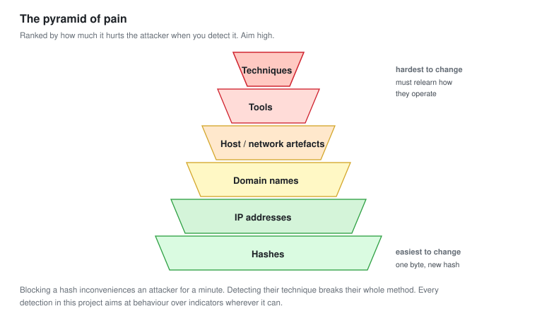

# 08 - Threat Intelligence Operations

Turning information about attackers into detections, hunts, and decisions. Not collecting feeds for their own sake.

---

## The Point of Intelligence

Threat intelligence is only intelligence if it changes what you do. Otherwise it is a news feed.

**Every piece of intelligence should end in an action:** a new detection, a hunt, a block, or a decision not to worry. Intelligence that ends in a dashboard nobody acts on is cost with no return.

This module is about operationalising intelligence, which means wiring it into the detection pipeline from [module 02](02-Detection-as-Code.md) and the hunt loop from [module 03](03-Threat-Hunting-Methodology.md).

---

## The Three Levels

Intelligence comes at three levels, for three audiences. A Tier 2 analyst mostly works the bottom two.

| Level | Answers | Audience | Example |
| --- | --- | --- | --- |
| **Strategic** | Who might target us and why | Leadership | "Ransomware groups are targeting our sector" |
| **Operational** | How a specific group operates | SOC leads, Tier 2 | "This group uses scheduled tasks and WMI" |
| **Tactical** | Specific indicators to detect | Tier 1, tooling | "Block this IP, this hash, this domain" |

**Operational intelligence is the most useful for detection engineering.** Tactical indicators expire fast, because attackers change IPs and hashes hourly. How a group operates changes slowly. A detection for their technique outlasts a hundred blocked IP addresses.

---

## The Pyramid of Pain

The idea that makes intelligence useful. It ranks indicators by how much it hurts the attacker when you detect them.



```text
Hard for attacker to change
        ^
        |   Tactics and techniques    they must relearn how they operate
        |   Tools                      they must find new software
        |   Host and network artefacts they must change behaviour
        |   Domain names               they must register new ones
        |   IP addresses               they change hourly
        |   Hashes                     one byte and it is new
        v
Easy for attacker to change
```

**Blocking a hash inconveniences an attacker for a minute. Detecting their technique breaks their whole method.** This is why operational intelligence beats tactical, and why every detection in this project aims at behaviour rather than indicators wherever possible.

---

## From Intelligence to Detection

The workflow. This is the operationalising.

```text
1. Intelligence arrives   (a report, a feed, an advisory)
2. Extract what is actionable
3. Decide the level: block it, detect it, or hunt for it
4. Build the artefact
5. Deploy or run it
6. Record that this intelligence was actioned
```

### An example, worked

A threat report describes a group that gains access by phishing, then uses `regsvr32` to run a remote scriptlet, then persists with a scheduled task.

**Extract the actionable parts:**

| From the report | Level | Action |
| --- | --- | --- |
| Two C2 IP addresses | Tactical | Block, and hunt for past contact |
| `regsvr32` running a remote scriptlet | Operational | Write a detection |
| Scheduled task named a specific way | Operational | Write a detection |
| The group targets our sector | Strategic | Note, inform leadership |

**Build the operational detections, block the tactical, hunt for the past.**

```yaml
title: Regsvr32 Running a Remote Scriptlet
id: 9c4a2f10-6b33-4d81-a1e2-8f3c5d7b0a49
description: Detects regsvr32 loading a remote scriptlet (the Squiblydoo technique), as described in threat reporting on [group].
references:
  - https://attack.mitre.org/techniques/T1218/010/
tags:
  - attack.defense_evasion
  - attack.t1218.010
logsource:
  category: process_creation
  product: windows
detection:
  selection:
    Image|endswith: '\regsvr32.exe'
    CommandLine|contains:
      - 'scrobj'
      - 'http'
      - '/i:'
  condition: selection
level: high
```

Deployed through the pipeline. **The IPs will be useless in a week. The technique detection will still be catching this group, and others who use the same method, in a year.**

### Hunt for the past

Tactical indicators are worth one thing before they expire: checking whether the attack already happened.

```kql
// Did we ever contact those C2 addresses
DeviceNetworkEvents
| where RemoteIP in ("203.0.113.10", "203.0.113.11")
| where TimeGenerated > ago(90d)
| project TimeGenerated, DeviceName, InitiatingProcessFileName, RemoteIP
```

**A new indicator is a reason to look backwards.** The IP might be blocked going forward, but if a machine contacted it three weeks ago, you have an incident you did not know about. Every new tactical indicator triggers a retrospective hunt.

---

## Managing Indicators

Indicators need a home, a lifecycle, and an expiry. A block list nobody prunes becomes a performance problem and a source of false positives.

| Field | Why |
| --- | --- |
| The indicator | The IP, hash, domain |
| Type | So tooling knows how to use it |
| Source | Where it came from, and how much to trust it |
| First and last seen | When it was relevant |
| Confidence | High, medium, low |
| Expiry | When to stop blocking it |
| Action taken | Blocked, detection built, hunted |

**Expiry is the field people leave out.** An IP address that was C2 last year may be a legitimate service this year, because addresses get reassigned. Blocking it forever eventually blocks something real. Tactical indicators should expire; operational detections should not.

### Where they live

In a real SOC, a threat intelligence platform (MISP is the common free one) holds these and feeds them to the SIEM automatically. In this lab, the Sentinel `ThreatIntelligenceIndicator` table and a Wazuh CDB list do the same job at small scale.

```bash
# Wazuh: a constant database list of bad IPs, checked by a rule
echo "203.0.113.10:" >> /var/ossec/etc/lists/malicious-ips
```

---

## Enriching an Alert With Intelligence

When an alert fires, intelligence answers "how worried should I be." This ties back to the SOAR enrichment from [SOC-02](../SOC-Analyst-1/06-SOAR-Automation.md).

```text
Alert fires on a connection to an external IP
        |
        v
Enrich:  is this IP known bad?         (reputation)
         have we seen it before?        (internal history)
         what does intel say about it?  (associated group, campaign)
        |
        v
The analyst opens the alert with the answer already attached
```

**Internal history beats external reputation.** An IP with no reputation that three of your machines contacted for the first time today is more interesting than a known-bad IP that one machine hit once. External intelligence tells you what the world thinks. Internal telemetry tells you what is happening to you. Use both, but weight the second.

---

## Attribution, and Why to Be Careful

Threat reports name groups. It is tempting to say "we were hit by [named group]." Resist it at Tier 2.

**Attribution is hard, often wrong, and rarely changes what you do.** Two different groups using the same technique produce the same evidence. Naming the group confidently from technique alone is guessing, and a wrong name in a report costs credibility.

What matters for defence is the technique, not the name. "The attacker used regsvr32 to run a remote scriptlet" is actionable and provable. "This was [group]" is a claim you probably cannot support and do not need.

**Report what you can prove. Leave attribution to those with the full picture.**

---

## Checklist

- [ ] Every piece of intelligence ends in an action, not a dashboard
- [ ] You prioritise operational intelligence over tactical
- [ ] You understand the pyramid of pain and aim detections high on it
- [ ] Tactical indicators trigger a retrospective hunt before they expire
- [ ] Indicators have a source, a confidence, and an expiry
- [ ] Alerts are enriched with both external reputation and internal history
- [ ] You weight internal history over external reputation
- [ ] You report techniques, not attribution guesses

---

Next: [09-Metrics-and-Maturity.md](09-Metrics-and-Maturity.md)
