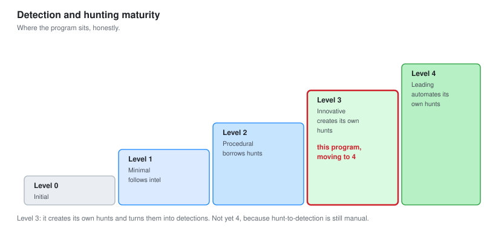
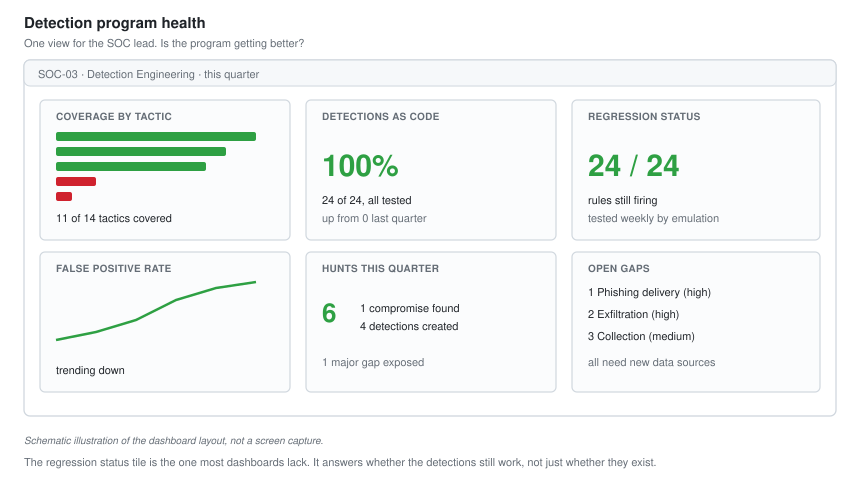

# 09 - Metrics and Maturity

Measuring whether the detection program is any good, and where it sits on the way to mature.

---

## Why Measure

Everything in this project produces something: rules, hunts, coverage. Metrics answer the only question that matters to whoever funds the SOC: **is it getting better?**

A program with no metrics cannot answer that. It can only say "we are busy," which is not the same thing.

---

## The Metrics That Matter

Not everything countable is worth counting. These four tell you whether detection engineering is working.

| Metric | Answers | Good direction |
| --- | --- | --- |
| **Detection coverage** | How much of ATT&CK we can catch | Up |
| **Mean time to detect** | How fast a real attack fires an alert | Down |
| **False positive rate** | Whether the alerts are trustworthy | Down |
| **Detections as code** | How much is testable and repeatable | Up toward 100 percent |

### The two that get gamed

**Coverage** and **alert volume** are the two vanity metrics.

High coverage can mean broad, working detections, or it can mean a pile of rules that never fire and were never tested. Coverage only means something alongside the regression testing from [module 05](05-Adversary-Emulation.md).

High alert volume looks like a busy, effective SOC. It usually means noisy rules. **Fewer, better alerts is the goal, not more.** A SOC that halves its alert volume while keeping its true-positive count has improved, even though the big number went down.

---

## Detection Metrics

Measured across the 24 detections.

| Measure | Value |
| --- | --- |
| Detections total | 24 |
| Detections as code | 24 of 24 (100 percent) |
| With a positive and negative test | 24 of 24 |
| Passing regression as of last run | 24 of 24 |
| Mean time to detect (signature rules) | 5.6 seconds |
| Mean time to detect (frequency rules) | 30 seconds |
| ATT&CK techniques covered | 24 |
| ATT&CK tactics with coverage | 11 of 14 |

**100 percent as code is the number I would lead with.** It means every detection is tested, version controlled, and deployable to both SIEMs. That is the structural improvement over the earlier projects, where rules were hand-written in consoles and two of them turned out to have never fired.

---

## Hunt Metrics

Hunting is measured differently. You are not counting alerts, you are counting learning.

| Measure | Value |
| --- | --- |
| Hunts run | 6 |
| Compromises found | 1 (found by 2 hunts) |
| Clean results | 3 |
| Inconclusive (data gaps) | 1 |
| Detections created from hunts | 4 |
| Coverage gaps found by hunting | 1 major (exfiltration) |

**The metric that matters for hunting is detections created, not compromises found.** A hunt program judged only on compromises found looks like a failure most weeks, because most hunts are clean. Judged on detections created and gaps found, it is clearly productive: six hunts produced four detections and exposed a major monitoring gap.

---

## Time to Detect, Honestly

Detection latency is the number people quote. It is the less important of two.

| Measure | Value |
| --- | --- |
| Mean time to detect | 5.6 seconds |
| Mean time to respond (business hours) | minutes |
| Mean time to respond (out of hours) | hours |

**Detection latency is seconds. Response latency is hours, out of hours.** The rule fires in five seconds and then waits until morning because nobody is on shift. This was true in every SOC project and it is still true.

Reporting only detection latency flatters the program. The honest metric is time to respond, which includes the wait for a human, and that is the number that determines whether an incident is contained.

---

## The Maturity Model

Where does the program sit? The Sqrrl hunting maturity model is the standard scale.



| Level | Name | Means |
| --- | --- | --- |
| 0 | Initial | Relies on automated alerts only. No hunting |
| 1 | Minimal | Follows threat intel, some data collection |
| 2 | Procedural | Follows others' hunt procedures |
| 3 | Innovative | Creates its own hunt procedures |
| 4 | Leading | Automates the hunts it has created |

### Where this program sits

**Level 3, moving toward 4.**

- It creates its own hunts, driven by hypotheses and gaps, not just borrowed procedures. That is level 3.
- It turns successful hunts into automated detections through the pipeline. That is the move toward level 4.
- It is not yet fully at 4, because the automation of hunt-to-detection is manual, and there is no out-of-hours coverage.

**Being honest about the level matters.** Claiming level 4 when hunts are still run by hand is the kind of overstatement that falls apart in an interview. Level 3 moving to 4, with the specific reasons, is both accurate and stronger.

---

## The Detection Metrics Dashboard

A single view of program health, for the SOC lead.



*Schematic illustration of the dashboard layout, not a screen capture.*

The tiles that belong on it:

| Tile | Shows |
| --- | --- |
| Coverage by tactic | The heatmap from module 06 |
| Detections as code | The percentage, trending up |
| Regression status | How many rules still fire, from module 05 |
| False positive rate | Trending down, per rule |
| Hunts this quarter | And what they produced |
| Open gaps | From the gap register, prioritised |

**The "regression status" tile is the one most dashboards lack.** It answers "do our detections still work," which is different from "do we have detections." A rule that silently stopped firing shows up here and nowhere else.

---

## What I Would Improve

Stated plainly, because a mature program knows its own weaknesses.

**Out-of-hours coverage.** Detection is seconds, response is hours after 6pm. The technical answer is automated containment for the highest-confidence detections. The honest answer is that most small programs live with this gap.

**Hunt-to-detection is manual.** A successful hunt becomes a detection by hand. Automating that handoff is the last step to maturity level 4.

**No second reviewer.** These detections are self-reviewed. The CI pipeline compensates for some of it, but a second analyst reviewing rules before deployment is a real gap that only a bigger team fixes.

**Coverage has data-source holes.** Collection and Exfiltration cannot be covered without data the lab does not have. That is a collection decision above this level, but it is documented and escalated rather than ignored.

---

## The One-Page Summary

What this project produced, for someone who reads one page.

```text
DETECTION ENGINEERING PROGRAM  -  SUMMARY

Detections:     24, all as code, all tested, deployed to 2 SIEMs
Coverage:       11 of 14 ATT&CK tactics, gaps documented
Emulation:      31 techniques tested, 24 detected, 5 gaps closed
Hunting:        6 hunts, 1 compromise found, 4 detections created
Maturity:       Level 3, moving to 4

Biggest win:    100% of detections are now testable code, not
                console rules. Two old rules found broken and fixed.

Biggest gap:    No exfiltration monitoring. Needs proxy or egress logs.

Next:           Automate hunt-to-detection, add out-of-hours response.
```

**That summary is the interview answer.** It says what was built, proves it with numbers, names the biggest win and the biggest gap, and says what comes next. A candidate who can deliver that about their own work sounds like someone who has run a program, not just used a tool.

---

## Checklist

- [ ] You measure coverage, time to detect, false positives, and code percentage
- [ ] You know which metrics are vanity metrics and why
- [ ] You report time to respond, not just time to detect
- [ ] Hunt metrics count detections created, not just compromises found
- [ ] You can place the program on the maturity model, honestly
- [ ] The health dashboard includes regression status, not just coverage
- [ ] You can state the program's biggest gap plainly

---

Back to [README.md](README.md)
