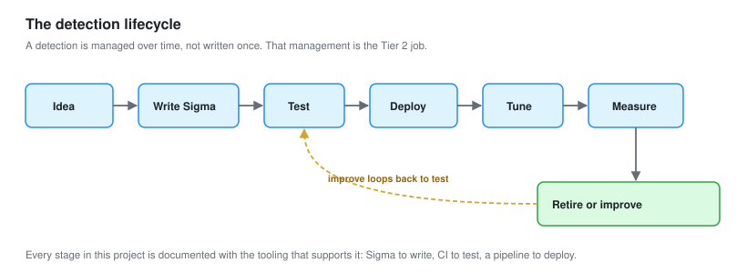

# SOC-03: Threat Hunting and Detection Engineering

**Role target:** SOC Analyst II / Tier 2 Analyst
**Focus:** Building the detections, hunting for what they miss, and proving coverage
**Environment:** The Sentinel and Wazuh labs from SOC-01 and SOC-02, plus adversary emulation

---

## What Changes at Tier 2

A Tier 1 analyst works the alert queue. A Tier 2 analyst builds the queue, hunts for what never fired an alert, and measures whether the coverage is real.

That is the whole difference, and it is what this project demonstrates.

| Tier 1 does | Tier 2 does |
| --- | --- |
| Works alerts as they arrive | Writes and tunes the detections that raise them |
| Follows playbooks | Writes the playbooks |
| Escalates what it cannot resolve | Receives those escalations and runs them to ground |
| Trusts the tools caught it | Hunts for what the tools missed |
| Reports what happened | Measures whether the program is improving |

[SOC-01](../Junior-SOC-Analyst/) and [SOC-02](../SOC-Analyst-1/) were about operating a SOC. This one is about improving it.

---

## What This Project Is

Five things a Tier 2 analyst is actually hired to do, each built and documented.

**A detection-as-code pipeline.** Detections written once as Sigma, version controlled, tested automatically, and deployed to both Wazuh and Sentinel. Covered in [02-Detection-as-Code.md](02-Detection-as-Code.md).

**Threat hunting.** Hypothesis-driven, not alert-driven. A repeatable method, then six hunts worked end to end, including the ones that found nothing. In [03-Threat-Hunting-Methodology.md](03-Threat-Hunting-Methodology.md) and [04-Hunt-Case-Files.md](04-Hunt-Case-Files.md).

**Adversary emulation.** Running a real attack technique library against the lab, purple-team style, to prove detections fire and find the gaps. In [05-Adversary-Emulation.md](05-Adversary-Emulation.md).

**Coverage measurement.** Mapping every detection to MITRE ATT&CK, finding the holes honestly, and prioritising them. In [06-Detection-Coverage.md](06-Detection-Coverage.md).

**Deeper investigation.** Malware triage and threat intelligence operations, the skills a Tier 1 escalation lands on. In [07-Malware-Triage.md](07-Malware-Triage.md) and [08-Threat-Intelligence-Operations.md](08-Threat-Intelligence-Operations.md).

---

## The Detection Lifecycle



A detection is not written once and forgotten. It has a lifecycle, and managing that lifecycle is the Tier 2 job.

```text
Idea  ->  Write as Sigma  ->  Test  ->  Deploy  ->  Tune  ->  Measure  ->  Retire or improve
                                 ^                                              |
                                 +----------------------------------------------+
```

Every stage is documented in this project with the tooling that supports it.

---

## Results

| Measure | Result |
| --- | --- |
| Detections written as code | 24, in Sigma |
| SIEM targets deployed to | 2, Wazuh and Sentinel, from one source |
| Hunts run | 6, worked end to end |
| Hunts that found something | 2 of 6 |
| Techniques emulated | 31, via Atomic Red Team |
| Techniques detected | 24 of 31 (77 percent) |
| Detection gaps found and documented | 7 |
| Gaps closed with a new detection | 5 |
| ATT&CK tactics with coverage | 11 of 14 |

**Two of six hunts finding something is a realistic number, not a failure.** A hunt that finds nothing narrows where a problem can be and builds the baseline. Presenting only successful hunts would be a highlight reel, not a record of the work.

---

## Detection Coverage


Coverage measured honestly, including where it is thin.

| Tactic | Detections | Coverage |
| --- | :---: | --- |
| Initial Access | 2 | Partial |
| Execution | 5 | Strong |
| Persistence | 4 | Strong |
| Privilege Escalation | 2 | Partial |
| Defense Evasion | 4 | Strong |
| Credential Access | 4 | Strong |
| Discovery | 1 | **Weak** |
| Lateral Movement | 3 | Good |
| Collection | 0 | **None** |
| Command and Control | 2 | Partial |
| Exfiltration | 0 | **None** |
| Impact | 1 | Weak |

**The three gaps are stated up front.** Discovery is hard to detect without noise. Collection and Exfiltration need data sources the lab does not have. Each is explained in [06-Detection-Coverage.md](06-Detection-Coverage.md) with what it would take to close it.

---

## Documents

| | |
| --- | --- |
| [01-Detection-Engineering-Lab.md](01-Detection-Engineering-Lab.md) | The environment, the pipeline, the tooling |
| [02-Detection-as-Code.md](02-Detection-as-Code.md) | Sigma, conversion, version control, automated testing |
| [03-Threat-Hunting-Methodology.md](03-Threat-Hunting-Methodology.md) | Hypothesis-driven hunting, the loop, the frameworks |
| [04-Hunt-Case-Files.md](04-Hunt-Case-Files.md) | Six hunts worked end to end |
| [05-Adversary-Emulation.md](05-Adversary-Emulation.md) | Atomic Red Team, purple teaming, validating detections |
| [06-Detection-Coverage.md](06-Detection-Coverage.md) | ATT&CK mapping, gap analysis, prioritisation |
| [07-Malware-Triage.md](07-Malware-Triage.md) | Static and dynamic analysis, safely |
| [08-Threat-Intelligence-Operations.md](08-Threat-Intelligence-Operations.md) | Turning intelligence into detections |
| [09-Metrics-and-Maturity.md](09-Metrics-and-Maturity.md) | Measuring the program, and where it stands |

---

## Skills This Demonstrates

| Area | Evidence |
| --- | --- |
| Detection engineering | 24 detections as code, tested and deployed to two SIEMs |
| Sigma | Rules authored, converted, and version controlled |
| Threat hunting | A documented method and six worked hunts |
| Adversary emulation | Atomic Red Team run and mapped, purple-team validation |
| MITRE ATT&CK | Full coverage mapping and honest gap analysis |
| Malware analysis | Static and dynamic triage in a safe environment |
| Threat intelligence | IOC operationalisation, intel-to-detection workflow |
| Automation | A CI pipeline that tests detections before deployment |
| Metrics | Detection and hunt metrics, program maturity assessment |

---

## Honest Notes

**This builds on the earlier labs.** The Wazuh and Sentinel deployments from SOC-01 and SOC-02 are assumed. This project is the layer on top, and it references those rather than rebuilding them.

**Detection engineering is a team sport in real life.** In a real SOC these detections would be reviewed by others before deployment. Here they are self-reviewed, which is a genuine limitation, and the CI pipeline in module 02 is partly there to compensate for the missing second pair of eyes.

**The coverage gaps are real.** Collection and Exfiltration have no coverage at all, because the lab has no data-loss monitoring or proxy logs to build on. Rather than pretend, module 06 documents exactly what data source each missing tactic needs.

If you are reviewing this as a hiring manager, [04-Hunt-Case-Files.md](04-Hunt-Case-Files.md) shows how I think through an open-ended problem, and [06-Detection-Coverage.md](06-Detection-Coverage.md) shows whether I can be honest about what is not covered.
