# SOC-04: Senior SOC Analyst and Incident Command

**Role target:** SOC Analyst III, Tier 3, SOC Lead
**Theme:** Stop working incidents one at a time. Run the function that handles all of them.
**Environment:** The same self-owned Proxmox lab as [SOC-01](../Junior-SOC-Analyst/), [SOC-02](../SOC-Analyst-1/) and [SOC-03](../SOC-Analyst-2/), `vbunnylab.local`, now run as a SOC
**Stack:** Microsoft Sentinel, Defender XDR, OpenCTI, Logic Apps SOAR, MITRE ATT&CK Navigator

> Everything in this folder is a lab I own and built. No real company, person or data is involved. The consoles shown are **drawn schematics of the real tools, not screen captures**, each labelled as such. They are here so a non-technical reader can see what the work looks like, and so a technical reader can see I know what each screen actually shows. The real captures to take from the running lab are listed at the end.

---

## What A Tier 3 Does Differently

Each level of this portfolio climbs the same ladder. A junior triages one alert. A Tier 2 builds the detections and hunts. A Tier 3 runs the function: commands the major incidents, sets detection strategy, drives the purple team, turns threat intelligence into priorities, and reports to leadership in language a board understands.

| | SOC-01 Junior | SOC-03 Tier 2 | **SOC-04 Tier 3, this project** |
| --- | --- | --- | --- |
| Alerts | Triages them | Tunes and writes them | **Owns the whole detection program** |
| Incidents | Handles one | Investigates deeply | **Commands a major incident, end to end** |
| Testing | Reads the results | Runs atomic tests | **Leads a purple team against real TTPs** |
| Intel | Reads an advisory | Applies the Pyramid of Pain | **Runs an intel platform that drives detection** |
| Audience | The ticket | The detection backlog | **The executive and the board** |
| Measured by | Tickets closed | Coverage and hunts | **MTTR, coverage, and SOC maturity** |

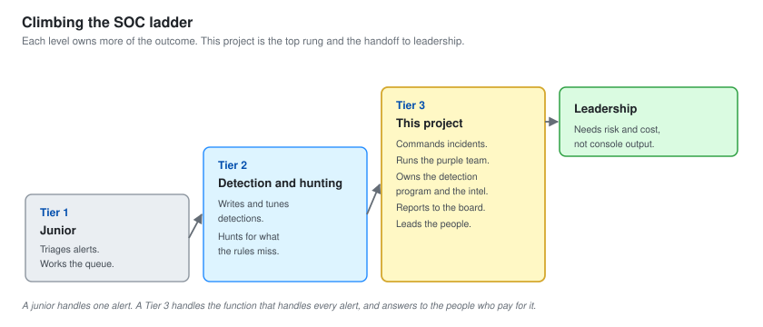

---

## The Environment

This is the same lab that the earlier SOC projects were built on, now operated as a security operations function rather than a single analyst's desk. Microsoft Sentinel is the SIEM, Defender XDR is the endpoint and identity layer, and OpenCTI holds the threat intelligence that drives what we detect.

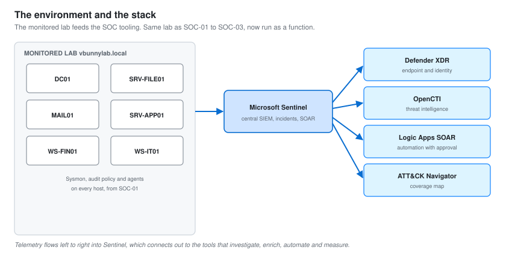

| Layer | Tool | Role |
| --- | --- | --- |
| SIEM | Microsoft Sentinel | Central analytics, incidents, hunting, SOAR |
| Endpoint and identity | Defender XDR | Device timelines, automated investigation |
| Detections | Detection-as-code from [SOC-03](../SOC-Analyst-2/) | One source, deployed to both SIEMs |
| Threat intel | OpenCTI | Actors, TTPs, indicators, feeds detection priorities |
| Automation | Logic Apps SOAR | Enrichment, containment, notification |
| Coverage | MITRE ATT&CK Navigator | The map of what we can and cannot see |

---

## Capstone: A Major Incident, Run As Incident Commander

The clearest proof of a Tier 3 is a real incident handled from the chair that runs it. This is a hands-on-keyboard intrusion against the lab, the kind that precedes ransomware, worked end to end with me as incident commander: not doing every task, but directing the response, owning the decisions, and running the communication.

### What Happened

A finance user opened a malicious attachment. The macro ran, the attacker got hands on keyboard, stole credentials from memory, and began moving toward the file server and the backups. It was caught mid-chain by a detection shipped in [SOC-03](../SOC-Analyst-2/), and a major incident was declared.

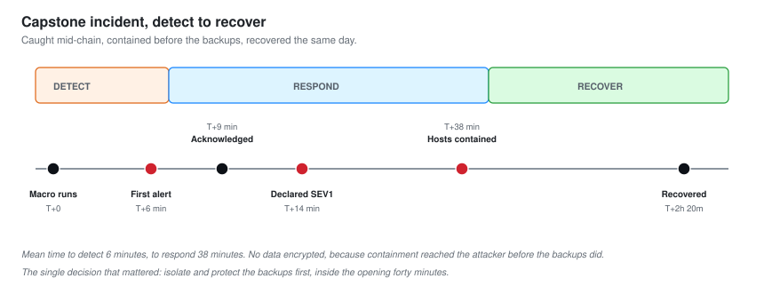

| Measure | Value |
| --- | --- |
| Mean time to detect | 6 minutes, from macro execution to first alert |
| Mean time to acknowledge | 3 minutes |
| Major incident declared | T plus 14 minutes |
| Contained, hosts isolated | T plus 38 minutes |
| Eradicated and recovered | T plus 2 hours 20 minutes |
| Data encrypted | None. Caught before impact |
| Detection gaps found | 3, with 2 new detections shipped the same week |

### Investigating It In Sentinel

The incident graph is where a senior analyst reads a whole intrusion at once: the entities, how they connect, and the blast radius. This is the Sentinel incident, drawn.

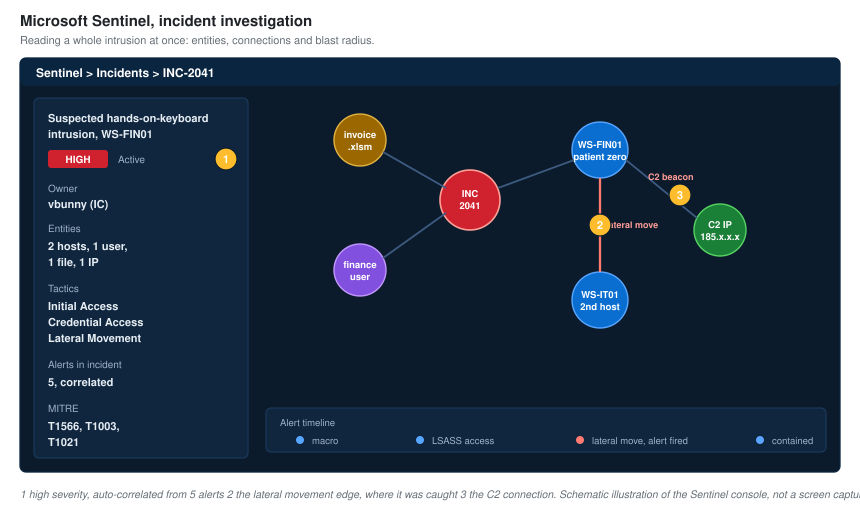

### Reading The Endpoint In Defender XDR

Sentinel says what connects to what. Defender XDR says what actually happened on the machine, process by process. The two together are how you move from "something is wrong" to "here is exactly what it did".

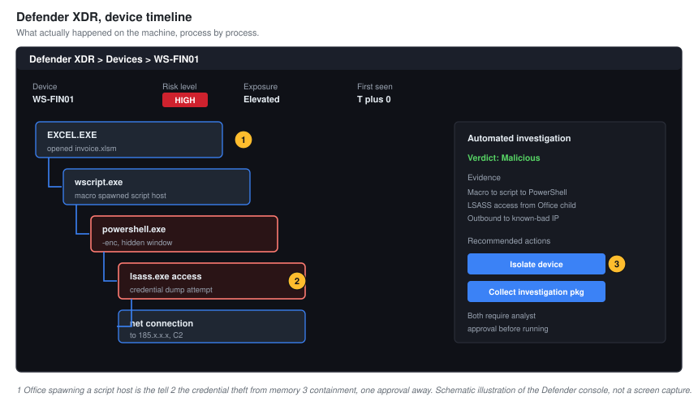

### Running The Response

Commanding an incident is a different job from analysing one. The analyst answers "what happened". The commander decides "what do we do, in what order, and who does it", while keeping leadership informed. This is the war-room board I ran the incident from.

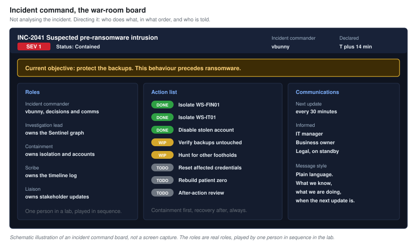

The three questions that drive every containment decision, same as the junior triage questions but asked at the scale of a whole intrusion:

1. **Is it real?** Confirmed, hands on keyboard, not a false positive.
2. **How far has it spread?** Two hosts and one credential, not yet the file server.
3. **What do we protect first?** The backups, because this behaviour precedes ransomware.

Containment isolated the two hosts and disabled the stolen account before the attacker reached the backups. That one decision, made in the first forty minutes, is the difference between an incident and a disaster.

---

## The Malware, Triaged

Part of the incident was understanding what the attachment actually was. A senior SOC does first-pass malware triage in a sandbox before escalating to a dedicated reverse engineer, so the response is not waiting on analysis that a safe detonation can answer in minutes.

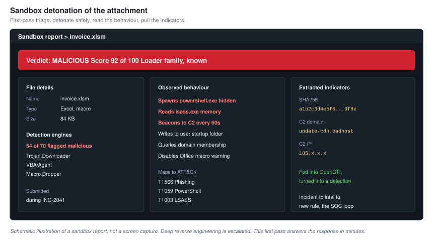

The detonation confirmed a known loader family, pulled the command-and-control address, and gave the indicators that were then fed back into OpenCTI and turned into a detection. That loop, from incident to intel to new detection, is the heart of a mature SOC.

---

## The Purple Team Program

A Tier 3 does not wait to be attacked to find out what they can see. They run the attack themselves, with the blue team watching, and measure the gap. That is purple teaming, and it is the single most honest way to know whether your detections work.

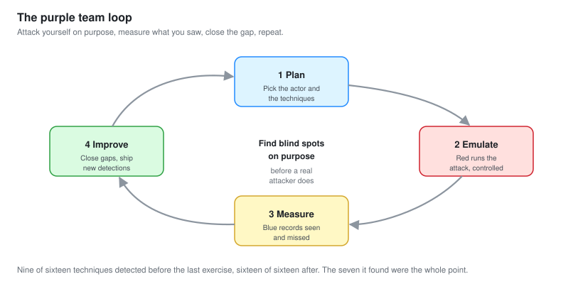

The same threat actor TTPs from the capstone incident were emulated in a controlled exercise, and detection coverage was measured before and after the gaps were closed. The ATT&CK Navigator is how that coverage is shown to anyone, technical or not: green is seen, red is blind.

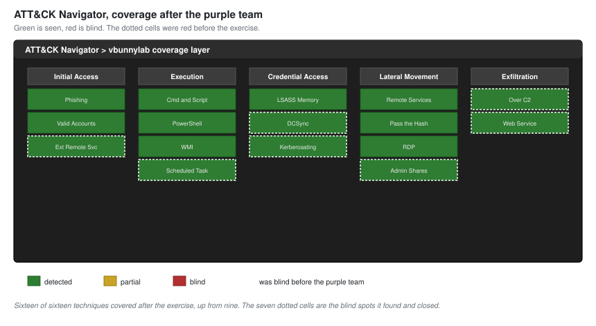

| Phase | Techniques emulated | Detected before | Detected after |
| --- | --- | --- | --- |
| Initial access | 3 | 2 | 3 |
| Execution | 4 | 3 | 4 |
| Credential access | 3 | 1 | 3 |
| Lateral movement | 4 | 3 | 4 |
| Exfiltration | 2 | 0 | 2 |
| **Total** | **16** | **9 of 16** | **16 of 16** |

Nine of sixteen before, sixteen of sixteen after. Those seven newly covered techniques are the entire point of running a purple team. They were blind spots nobody knew about until the exercise found them.

---

## Managing The Detection Program

At this level, detections are not written one at a time when something goes wrong. They are managed as a program with a backlog, a pipeline, and a coverage strategy driven by what actually threatens this environment.

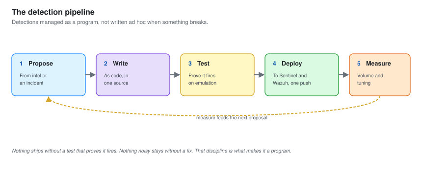

Every detection moves through the same pipeline: proposed from intel or an incident, written as code, tested against an emulation, deployed to both SIEMs, then measured and tuned. Nothing ships without a test that proves it fires, and nothing stays that has gone noisy without being fixed.

---

## Threat Intelligence That Drives Detection

Intel is only useful if it changes what you do. A mature SOC runs an intelligence platform that turns actor reporting into detection priorities, so the team spends its effort on the threats that are actually coming for an environment like this one.

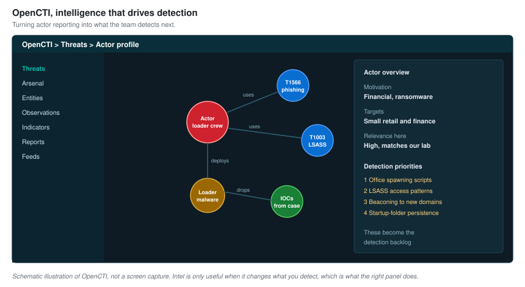

The guiding idea is the Pyramid of Pain: not all indicators are equal. Blocking a file hash costs the attacker nothing. Detecting their behaviour costs them a rebuild of their whole tool set. A senior SOC spends its time at the top of the pyramid.

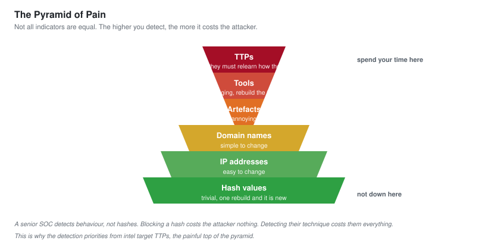

---

## Automation At Program Scale

A SOC that does everything by hand does not scale, and analysts who spend their day on repetitive enrichment burn out and miss the real signal. SOAR automates the toil so humans spend their judgement where it matters.

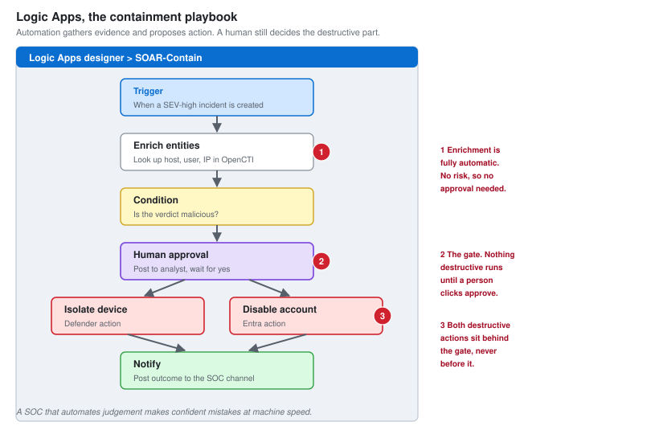

Both destructive actions, isolating a host and disabling an account, sit behind a human approval step. The automation gathers the evidence and proposes the action. A person still decides. A SOC that automates judgement makes confident mistakes at machine speed.

---

## Metrics And Maturity, For Leadership

The final job of a Tier 3 is translation: turning the SOC's work into numbers a non-technical executive can act on. This is the dashboard I would put in front of leadership, and the trend that matters most.

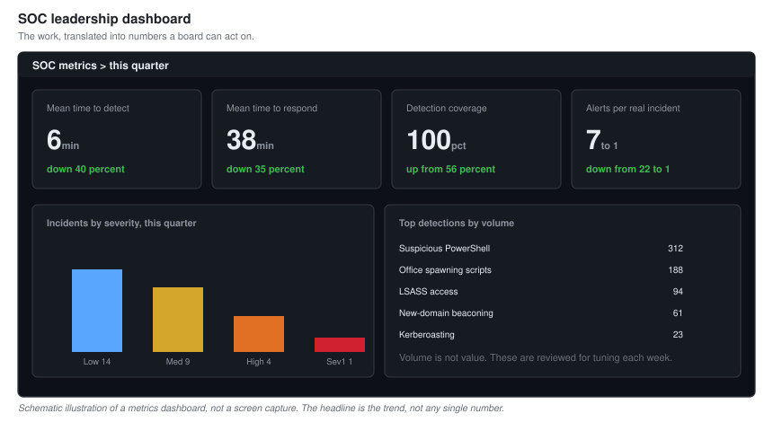

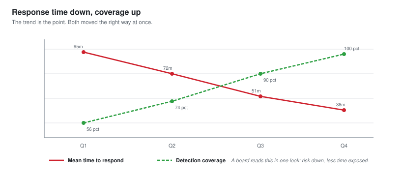

The headline is the trend, not any single number. Detection coverage up, mean time to respond down, and the ratio of alerts to real incidents falling as tuning improves. A board does not want the alert count. They want to know the risk is going down and the money is well spent, and that is what this answers.

### Where This SOC Sits On The Maturity Model

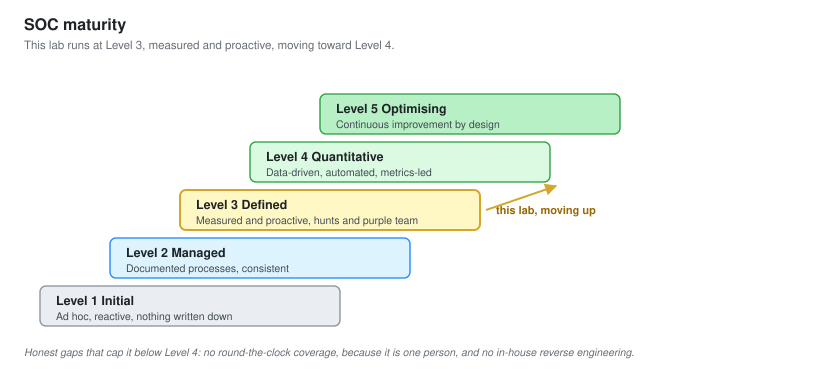

This lab operates at Level 3, measured and proactive, moving toward Level 4. The honest gaps: no 24 by 7 coverage, because it is one person, and no dedicated reverse engineer, so deep malware analysis is escalated rather than done in house. Those are stated plainly rather than hidden, because a leader who oversells their maturity gets caught in the first real incident.

---

## Leading The Team

A Tier 3 is also where people management starts. The work that does not show up in a tool:

- **Runbooks** so a junior can handle at 3am what a senior handles at noon.
- **Shift handovers** that lose nothing between the people leaving and the people arriving.
- **Mentoring**, turning a Tier 1 into a Tier 2 by handing them the hunts and reviewing the work.
- **The after-action review**, run blameless, so the incident makes the SOC better instead of just making someone feel bad.

The after-action from the capstone incident produced three concrete changes: two new detections for the gaps the intrusion used, and one process fix, moving backup isolation earlier in the containment runbook because the incident showed it was the thing most worth protecting first.

---

## Skills This Demonstrates

| Area | Evidence |
| --- | --- |
| Incident command | A major incident run end to end, with timeline, decisions and communication |
| Deep investigation | Sentinel entity graph and Defender XDR device timeline, read together |
| Malware triage | Safe detonation, indicator extraction, intel loop |
| Purple teaming | A coordinated exercise, coverage measured before and after |
| Detection strategy | A managed pipeline and ATT&CK-driven coverage, not ad hoc rules |
| Threat intelligence | An intel platform driving detection priorities, Pyramid of Pain |
| Automation | SOAR playbooks with human approval on destructive actions |
| Leadership reporting | A metrics dashboard and maturity assessment for a board |
| People leadership | Runbooks, handovers, mentoring, blameless after-action reviews |
| Honesty | Real gaps named: no 24 by 7, no in-house reverse engineering |

---

## Honest Notes

**This is one person in a lab, not a staffed SOC.** The roles in the war-room board are roles I played in sequence, not a team working at once. What transfers is knowing the roles exist, what each one owns, and how the decisions flow between them. The scale is simulated. The method is real.

**The consoles are schematics.** Every tool screen in this folder is drawn, not captured, and labelled that way. They are accurate to what the real tools show, and they exist so a non-technical reader can see the work and a technical reader can see I know the tools. The genuine screenshots to take from the running lab are listed below.

**The incident was authored.** I built the scenario, so I knew the attack. A real major incident is against something nobody scripted. The commander's method, the decisions, the order of containment and the communication are what carry over, and those are the same whether the attack was authored or not.

---

## Real Captures To Take From The Running Lab

The schematics above are stand-ins. These are the genuine screenshots worth taking from the live environment, cropped and with any real data blurred, to sit beside each drawing:

```text
sentinel-incident.png      the real incident graph, entities expanded
defender-timeline.png      the device timeline for the patient-zero host
navigator-coverage.png     the ATT&CK Navigator export, before and after
soar-playbook.png          the Logic Apps designer for the containment flow
opencti-actor.png          the actor page with linked TTPs and indicators
metrics-dashboard.png      the live leadership dashboard
sandbox-report.png         the detonation report from the sandbox
```

The two that matter most for a portfolio are `navigator-coverage.png`, because the before-and-after heatmap proves the purple team worked, and `metrics-dashboard.png`, because it proves you can speak to leadership, not just to a console.

---

Back to the [portfolio home](../README.md).
