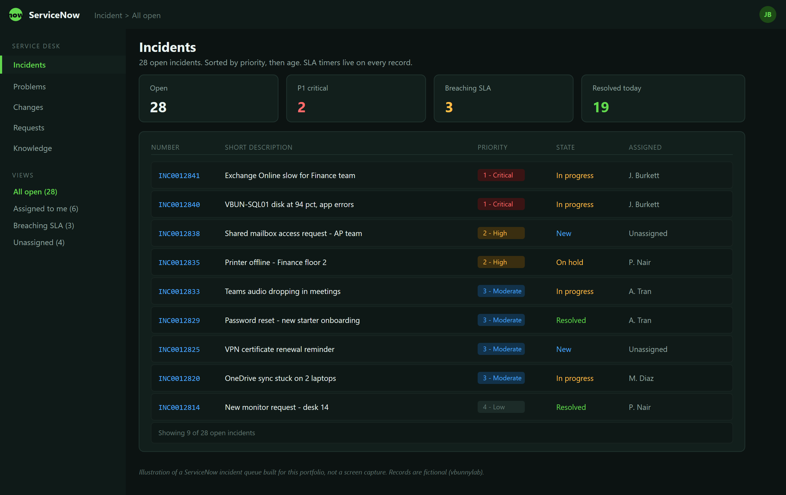

# ServiceNow

Working a queue in ServiceNow. Record types, ticket lifecycle, SLAs, and how to write notes that hold up.

ServiceNow does a great deal beyond ticketing. For a service desk it is where tickets arrive, where you talk to users, and where you write down what you did.

One rule underpins the rest. **If it is not in the ticket, it did not happen.**



*A ServiceNow incident queue: open tickets sorted by priority, with state, assignment and live SLA pressure visible at a glance.*

---

## Record Types

Getting these right matters. Logging a request as an incident skews every metric the service desk reports on.

| Type | Use | Example |
| --- | --- | --- |
| **Incident** | Something is broken | "Outlook crashes on launch" |
| **Service Request** | Someone wants something | "Access to the Finance share" |
| **Problem** | Underlying cause of repeated incidents | "VPN drops for 20 users every morning" |
| **Change** | A planned modification | "Patch the file server Sunday" |

**Incident restores service. Problem stops it recurring.**

Ten VPN tickets in a morning are ten incidents. The problem ticket is what finds out why. Close the incidents when the users are working again, and keep the problem open until the cause is fixed.

---

## Priority

Priority is calculated from **Impact** and **Urgency**, not set directly.

| | Definition |
| --- | --- |
| **Impact** | How many people, how badly |
| **Urgency** | How time-sensitive |

| Impact / Urgency | High | Medium | Low |
| --- | --- | --- | --- |
| **High** | P1 Critical | P2 High | P3 Moderate |
| **Medium** | P2 High | P3 Moderate | P4 Low |
| **Low** | P3 Moderate | P4 Low | P5 Planning |

Set both honestly. Every user believes their issue is urgent. One person unable to print is not the same as a department unable to work, and the SLA clock runs on that distinction.

---

## Working a Ticket

### Pick It Up

Assign it to yourself before you start. An unassigned ticket has nobody accountable, and in most configurations the SLA keeps running.

### Acknowledge

Send an **Additional Comment** straight away. The user sees it, and in many setups it stops the response-time clock.

```text
Hi Sarah,

I've picked up your ticket about Outlook crashing and I'm looking into it now.
I'll update you within the hour.

Barry
IT Support
```

Two lines. It costs nothing and it changes how the rest of the ticket goes.

### Additional Comments vs Work Notes

| Field | Who sees it | Use for |
| --- | --- | --- |
| **Additional Comments** | The user | Anything you want them to read |
| **Work Notes** | Internal only | Technical detail, what you tried, what you found |

**Check which field you are in before typing.** Internal detail pasted into a customer-visible comment is awkward at best. Put technical notes in Work Notes and plain language in Additional Comments.

### Update As You Go

For anything still open, update every 15 to 30 minutes with what you are actually doing.

```text
14:20 - Remoted in. Outlook opens in safe mode, crashes normally. Points to an add-in.
14:35 - Disabled all COM add-ins. Outlook opens. Re-enabling one at a time.
14:50 - Adobe Acrobat add-in is the cause. Left disabled. Confirmed with user.
```

Timestamps and specifics. Not "still investigating".

### Resolve

Before you resolve:

1. Confirm with the user that it is fixed. Do not assume.
2. Fill in resolution notes properly.
3. Set the resolution code.
4. Consider whether it should become a knowledge article.

Resolution notes are what the next person reads when the same thing happens.

**Bad:** "Fixed."

**Good:** "Outlook crashed on launch due to the Adobe Acrobat COM add-in. Started in safe mode to confirm, disabled all add-ins, re-enabled individually to identify. Acrobat add-in left disabled. User confirmed working at 14:50."

---

## Worked Examples

### Outlook Crashing

**Reported:** Outlook crashes on launch. Webmail works.

**Initial response:** Acknowledged, confirmed webmail as a workaround so the user is not blocked while I work.

**Diagnosis:** Remote session with approval. Started Outlook with `outlook.exe /safe`. It opened, which points at an add-in or the profile.

**Fix:** Disabled all COM add-ins, confirmed Outlook opened, re-enabled one at a time. A PDF add-in was the cause. Left it disabled and raised a separate ticket with the vendor version.

**Close:** User confirmed. Work notes with timestamps, resolution notes as above, resolved.

### VPN Failure

**Reported:** Cannot connect to VPN.

**Diagnosis:** Authentication failing. User had changed their domain password that morning. The VPN client still held the old credentials.

**Fix:** Cleared saved credentials in the client, signed in with the new password. Connected.

**Close:** Added an Additional Comment with the steps so the user can do it themselves next time. Resolved.

Worth noting as a pattern. A run of VPN tickets after a password expiry cycle is a problem ticket, not a series of unrelated incidents.

### Slow Network

**Reported:** Web pages loading very slowly.

**Diagnosis:** Remote session. `ipconfig /all` showed an IP conflict with another device on the subnet.

**Fix:**

```cmd
ipconfig /release
ipconfig /renew
ipconfig /flushdns
```

Confirmed a valid address in the DHCP range, not a `169.254.x.x` APIPA address. User confirmed speed restored.

**Follow-up:** Raised a problem ticket. An IP conflict usually means a static address inside the DHCP scope with no matching exclusion. Fixing the one machine leaves the cause in place.

---

## SLAs

Most configurations track two clocks.

| Clock | Measures |
| --- | --- |
| **Response** | How long until the user hears from you |
| **Resolution** | How long until it is fixed |

Acknowledging quickly stops the response clock. That is why the two-line acknowledgement matters, and why it is the single easiest way to improve service desk numbers.

The resolution clock usually pauses when a ticket is **Awaiting User**. Use that status honestly. Parking a ticket there to stop the clock while nobody is waiting on the user is gaming the metric, and it shows.

---

## Knowledge Base

Every resolved ticket is a candidate article.

**Knowledge**, **New**. Include:

- The symptom, in the words a user would use
- The cause
- The steps
- How to confirm it worked

Write for whoever reads it next, including a user searching self-service. Assume no context.

A good knowledge base turns a 20 minute ticket into a 2 minute one, and sometimes into no ticket at all.

---

## Assignment and Escalation

Escalate when it needs rights you do not have, it is outside your team, or you have hit the SLA threshold with no progress.

Include in the handover:

- What the user reported
- What you have tested, including what came back clean
- What you have ruled out and why
- Current status and what you believe the next step is

A good escalation saves the next person from starting over. A bad one just moves the ticket and restarts the clock.

---

## Practices

- Assign to yourself before starting
- Acknowledge within minutes
- Right record type. Incident, request, problem
- Impact and urgency set honestly
- Work Notes for technical detail, Additional Comments for the user
- Timestamped updates on anything long-running
- Confirm with the user before resolving
- Resolution notes that would help a stranger
- Raise a problem ticket when the same incident keeps arriving
- Write the knowledge article while the fix is fresh
