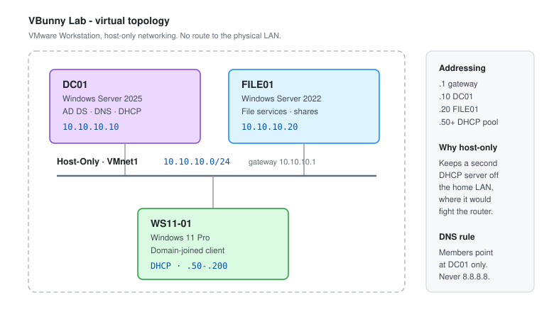

# Windows Server 2025 - Building the Lab

This is the end-to-end build for `vbunnylab.local`: a Windows Server 2025 domain controller, a domain-joined Windows 11 client, and the network between them. Everything else in this repository assumes this environment exists.

Windows Server 2025 is the current LTSC release, built on the Windows 11 codebase. Relative to 2022 it brings updated security baselines, SMB hardening that is on by default, improved storage performance, and hotpatching for eligible workloads.



---

## Build Order

The sequence matters. Renaming a server *after* promoting it to a domain controller is painful, and a DC that got its address from DHCP will break the first time the lease changes.

1. Create and install the VM
2. Install VMware Tools
3. **Rename the server**
4. **Set a static IP address**
5. Install AD DS and promote to domain controller
6. Build the OU structure
7. Create users and groups
8. Build and join the client

Steps 3 and 4 come before step 5. That ordering is the single most common thing to get wrong.

---

## Target Configuration

| Host | OS | Address | Role |
| --- | --- | --- | --- |
| `DC01` | Windows Server 2025 | `10.10.10.10` | AD DS, DNS, DHCP |
| `FILE01` | Windows Server 2022 | `10.10.10.20` | File services |
| `WS11-01` | Windows 11 Pro | DHCP `.50`-`.200` | Domain-joined client |

Domain: `vbunnylab.local` · Gateway: `10.10.10.1` · Subnet: `255.255.255.0`

---

## 1. Create the Virtual Machine

Download the **Windows Server 2025 evaluation ISO** from the Microsoft Evaluation Center. The evaluation runs for 180 days.

**Baseline for a domain controller:**

| Resource | Allocation |
| --- | --- |
| vCPUs | 2 |
| Memory | 4 GB minimum, 8 GB comfortable |
| Disk | 60 GB, NVMe |
| Network | Host-only (VMnet1) |
| Firmware | UEFI with Secure Boot |

In VMware Workstation Pro:

1. **File** → **New Virtual Machine** → **Typical** → **Next**.
2. **I will install the operating system later** → **Next**.
3. Guest OS: **Microsoft Windows**, version **Windows Server 2025** → **Next**.
4. Name it `DC01`, choose a location → **Next**.
5. Disk size **60 GB**, store as a single file → **Next**.
6. **Customize Hardware**:
   - **Memory** → 4096 MB or higher
   - **Processors** → 2
   - **Network Adapter** → **Host-only**
   - **New CD/DVD (SATA)** → **Use ISO image file** → browse to the ISO
7. **Close** → **Finish**.

> **Host-only, not NAT.** This lab runs its own DHCP server. On a NAT or bridged adapter it competes with the router on your home network and starts handing out addresses to real devices. Host-only keeps it contained. The trade-off is no internet access inside the lab - switch to NAT temporarily if you need to pull updates, then switch back.

---

## 2. Install Windows Server 2025

1. **Power on this virtual machine**, click inside the window, press a key to boot from the ISO.
2. Set language, time format and **keyboard: US** → **Next**.
3. Choose **Windows Server 2025 Standard Evaluation (Desktop Experience)**.

   *Desktop Experience* includes the GUI. *Server Core* has no desktop and is the better production choice - smaller attack surface, fewer patches. Use Desktop Experience while learning the consoles.

4. Accept the licence terms → **Next**.
5. **Custom install** → select the unallocated disk → **Next**.
6. Wait for installation and the reboot.
7. Set the built-in **Administrator** password.

### VMware Tools

Needed for display scaling, clipboard sharing and clean shutdown.

1. **VM** → **Install VMware Tools**.
2. Open **File Explorer** → the mounted VMware Tools disc → run **setup64.exe**.
3. Complete the wizard and restart.

---

## 3. Rename the Server

Do this now. Renaming a domain controller afterwards means demoting and re-promoting it.

1. **File Explorer** → right-click **This PC** → **Properties**.
2. **Advanced system settings** → **Computer Name** tab → **Change**.
3. Enter `DC01` → **OK** → restart.

```powershell
Rename-Computer -NewName 'DC01' -Restart
```

---

## 4. Set a Static IP Address

A domain controller must be reachable at a fixed address, and it must resolve DNS through itself.

1. **Control Panel** → **Network and Internet** → **Network and Sharing Center**.
2. **Change adapter settings** → right-click **Ethernet0** → **Properties**.
3. Double-click **Internet Protocol Version 4 (TCP/IPv4)**.
4. Select **Use the following IP address**:

   | Field | Value |
   | --- | --- |
   | IP address | `10.10.10.10` |
   | Subnet mask | `255.255.255.0` |
   | Default gateway | `10.10.10.1` |
   | Preferred DNS server | `127.0.0.1` |

5. **OK** → **Close**.

```powershell
New-NetIPAddress -InterfaceAlias 'Ethernet0' -IPAddress 10.10.10.10 `
  -PrefixLength 24 -DefaultGateway 10.10.10.1
Set-DnsClientServerAddress -InterfaceAlias 'Ethernet0' -ServerAddresses 127.0.0.1
```

Verify with `ipconfig /all`.

> **Preferred DNS is the loopback**, because this server is about to become the DNS server. Pointing a DC at an external resolver breaks SRV record registration, and with it domain logon.

---

## 5. Install AD DS and Promote

### Install the Role

1. **Server Manager** → **Manage** → **Add Roles and Features**.
2. **Next** past *Before you begin*.
3. **Role-based or feature-based installation** → **Next**.
4. Select `DC01` from the server pool → **Next**.
5. Tick **Active Directory Domain Services** → **Add Features** → **Next**.

   This pulls in AD DS, Group Policy Management, and the AD DS role administration tools.

6. **Next** through Features and the AD DS notes → **Install**.

### Promote to Domain Controller

1. Click the **notification flag** → **Promote this server to a domain controller**.
2. **Deployment Configuration** → **Add a new forest** → root domain name `vbunnylab.local` → **Next**.
3. **Domain Controller Options**:
   - Forest and domain functional level: **Windows Server 2016** or higher
   - Leave **DNS server** and **Global Catalog** ticked
   - Set the **DSRM password**
4. **DNS Options** - the delegation warning is expected for a new forest with no parent zone. Continue.
5. **Additional Options** - accept the NetBIOS name `VBUNNYLAB` → **Next**.
6. **Paths** - accept the defaults → **Next**.
7. Review, run the **prerequisites check**, then **Install**. The server reboots automatically.

```powershell
Install-WindowsFeature AD-Domain-Services -IncludeManagementTools
Install-ADDSForest -DomainName 'vbunnylab.local' -DomainNetbiosName 'VBUNNYLAB' -InstallDns
```

> **The DSRM password is not the domain admin password.** It boots the DC into Directory Services Restore Mode, which is where you go when AD itself is broken. Record it somewhere that does not depend on the domain being up.

### Verify the Promotion

After the reboot, sign in as `VBUNNYLAB\Administrator`:

```powershell
Get-ADDomain
Get-ADDomainController
Resolve-DnsName -Type SRV _ldap._tcp.dc._msdcs.vbunnylab.local
dcdiag /v
```

The SRV lookup is the one that matters - if those records are missing, no client will be able to find the domain.

---

## 6. Open the Management Consoles

| Console | Command | Purpose |
| --- | --- | --- |
| Active Directory Users and Computers | `dsa.msc` | Day-to-day object management |
| Active Directory Administrative Center | `dsac.exe` | Recycle Bin, fine-grained password policies |
| Group Policy Management | `gpmc.msc` | GPO authoring and linking |
| DNS Manager | `dnsmgmt.msc` | Zones and records |
| AD Sites and Services | `dssite.msc` | Replication topology |

Also reachable from **Server Manager** → **Tools**, or **Start** → **Windows Tools**.

---

## 7. Build the OU Structure

See [Active Directory](../Windows-Server/Active-Directory.md) for the reasoning behind this layout and why objects must not stay in the built-in containers.

```powershell
$base = 'DC=vbunnylab,DC=local'
New-ADOrganizationalUnit -Name 'VBunnyLab' -Path $base

$parent = "OU=VBunnyLab,$base"
'Accounting','HR','IT','Servers','Workstations' | ForEach-Object {
    New-ADOrganizationalUnit -Name $_ -Path $parent
}

# new machines land somewhere a GPO can reach
redircmp "OU=Workstations,$parent"
```

Through the GUI: **ADUC** → right-click the domain → **New** → **Organizational Unit**.

---

## 8. Create Users and Groups

```powershell
$ouIT = 'OU=IT,OU=VBunnyLab,DC=vbunnylab,DC=local'

New-ADUser -Name 'Barry Allen' -GivenName 'Barry' -Surname 'Allen' `
  -SamAccountName 'ballen' -UserPrincipalName 'ballen@vbunnylab.local' `
  -Path $ouIT -AccountPassword (Read-Host -AsSecureString 'Temp password') `
  -ChangePasswordAtLogon $true -Enabled $true

New-ADGroup -Name 'GG-IT-Staff' -GroupScope Global -GroupCategory Security -Path $ouIT
Add-ADGroupMember -Identity 'GG-IT-Staff' -Members ballen
```

Through the GUI: right-click the OU → **New** → **User**, then the group's **Members** tab → **Add** → **Check Names**.

---

## 9. Build and Join the Windows 11 Client

Create a second VM named `WS11-01` - 2 vCPUs, 4 GB RAM, 60 GB disk, **host-only** adapter, Windows 11 Pro. Home edition cannot join a domain.

### Point It at the Domain Controller

The client must be on the same subnet and must use DC01 for DNS. This is the step that decides whether the join works.

1. **Control Panel** → **Network and Internet** → **Network and Sharing Center** → **Change adapter settings**.
2. Right-click **Ethernet0** → **Properties** → **Internet Protocol Version 4 (TCP/IPv4)**.
3. Either leave it on DHCP once the scope exists, or set it manually:

   | Field | Value |
   | --- | --- |
   | IP address | `10.10.10.50` |
   | Subnet mask | `255.255.255.0` |
   | Default gateway | `10.10.10.1` |
   | Preferred DNS server | `10.10.10.10` |

### Verify Connectivity First

```powershell
Test-NetConnection 10.10.10.10 -Port 389
Resolve-DnsName vbunnylab.local
```

Port 389 is LDAP. If that fails, the join will fail - fix the network before continuing. A plain `ping` only proves the host is up, not that the directory is reachable.

### Join the Domain

1. **File Explorer** → right-click **This PC** → **Properties**.
2. Scroll to **Domain or workgroup** → **Change**.
3. Under **Member of**, select **Domain** and enter `vbunnylab.local` → **OK**.
4. Supply domain administrator credentials when prompted.
5. Accept the welcome message and restart.

```powershell
Add-Computer -DomainName 'vbunnylab.local' `
  -Credential (Get-Credential VBUNNYLAB\Administrator) -Restart
```

### Sign In and Confirm

1. At the sign-in screen choose **Other user**.
2. Sign in as `VBUNNYLAB\ballen` or `ballen@vbunnylab.local` and set a new password.
3. On DC01, open **ADUC** and confirm `WS11-01` appears under **Workstations**.

```powershell
Get-ADComputer -Filter * -Properties OperatingSystem, LastLogonDate |
    Select-Object Name, OperatingSystem, LastLogonDate
```

---

## Troubleshooting the Join

| Error | Cause | Fix |
| --- | --- | --- |
| "An Active Directory domain controller could not be contacted" | DNS | Client must point at `10.10.10.10`, not a public resolver |
| "The network path was not found" | No connectivity | Both VMs on the same host-only adapter? `Test-NetConnection -Port 389` |
| "The specified domain either does not exist" | Name or DNS | `Resolve-DnsName _ldap._tcp.dc._msdcs.vbunnylab.local` on the client |
| "Access is denied" during join | Credentials | Use `VBUNNYLAB\Administrator`, not the local account |
| Join works, logon fails | Password/policy | Confirm the account is enabled and not locked |
| Windows 11 Home | Edition limit | Home cannot join a domain - Pro or Enterprise only |

```powershell
nltest /dsgetdc:vbunnylab.local
Test-ComputerSecureChannel -Verbose
```

---

## Snapshot Before You Break It

Once the domain controller is promoted, the OUs exist and the client is joined, take a VMware snapshot of every VM in the lab and label it.

```text
DC01     - baseline: domain promoted, OUs built, DNS verified
WS11-01  - baseline: domain-joined, test user signed in
```

Snapshot restore is what makes the lab useful for destructive testing. Without one, a broken GPO or a bad permissions change means rebuilding from the ISO.

> **Snapshots and domain controllers:** restoring a DC snapshot in a multi-DC environment can cause USN rollback and replication damage. With a single DC it is safe. It is worth knowing the distinction before applying the habit at work.

---

## Security Notes

- **Rename the built-in Administrator** and create a separate named admin account. The default name is the first thing anything automated will try.
- **Set the account lockout policy early** - Server 2025 supports **Allow Administrator account lockout**, which closes a long-standing gap where the built-in account could be sprayed indefinitely. See [Group Policy Management](../Windows-Server/Group-Policy-Management.md).
- **SMB signing and encryption** are enforced by default in Server 2025. If an older client cannot connect, fix the client rather than disabling the control.
- **Keep the lab isolated.** Host-only networking is a containment boundary as much as a convenience - a deliberately vulnerable lab machine should never be reachable from the home LAN.
- **Do not reuse real passwords in the lab.** Lab credentials end up in screenshots, scripts and documentation.
