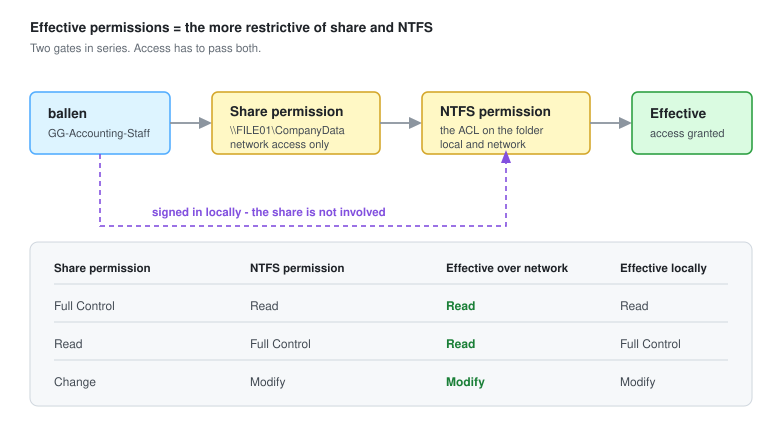

# File Server and Permissions

Building a departmental file server on `FILE01`, securing it with NTFS permissions driven by Active Directory security groups, and delivering it to users automatically through Group Policy.

The permissions model is where this goes wrong most often - not because it is complicated, but because share permissions and NTFS permissions are two separate systems that combine in a way that is easy to get backwards.



---

## The Permissions Model

Two independent systems:

| | Share permissions | NTFS permissions |
| --- | --- | --- |
| Stored on | The share object | The filesystem ACL |
| Applies to | Network access only | Local **and** network access |
| Granularity | Whole share | Per file and per folder |
| Levels | Read, Change, Full Control | Read, Write, Read & Execute, List, Modify, Full Control |
| Survives a move? | n/a | Follows the folder on the same volume |

**Over the network, both are evaluated and the more restrictive wins.** Share: Full Control with NTFS: Read gives Read. Share: Read with NTFS: Full Control also gives Read.

**Locally, the share is not involved at all.** Anyone signing in at the console - or over RDP - is evaluated against NTFS only. A folder protected only by share permissions is wide open to anyone who can log on to the server.

### The Practical Approach

Set the share permission once to **Authenticated Users - Full Control**, then do all real access control in NTFS.

This is not laziness. It means there is exactly one place to look when answering "who can reach this folder", instead of reconciling two sets of rules that both have to be checked. Two overlapping systems is how you end up with a folder nobody can explain.

> **Avoid `Everyone` on the share**, even though it is often suggested. `Authenticated Users` excludes anonymous and guest sessions at no cost.

### NTFS Permission Levels

| Level | Grants |
| --- | --- |
| **Read** | Open files, view contents and attributes |
| **List folder contents** | Browse folder structure (folders only) |
| **Read & Execute** | Read, plus run executables |
| **Write** | Create new files and folders, write to existing ones |
| **Modify** | Read, Execute, Write, **and delete** |
| **Full Control** | Modify, plus change permissions and take ownership |

**Modify is the right default for a department share.** Full Control lets users rewrite the ACL and take ownership of files - which means they can grant themselves or others access you did not intend, and it will not show up until someone audits it.

---

## 1. Create the Folder Structure

On `FILE01`:

```powershell
New-Item -Path 'C:\CompanyData' -ItemType Directory
'Accounting','HR','IT','Marketing' | ForEach-Object {
    New-Item -Path "C:\CompanyData\$_" -ItemType Directory
}
```

Through the GUI: **File Explorer** → `C:\` → new folder `CompanyData`, then one subfolder per department.

---

## 2. Create Security Groups

Permissions go to groups, never to individual users. When someone changes department, you change one group membership rather than hunting through ACLs.

Following AGDLP - accounts into **Global** groups, global groups into **Domain Local** groups, domain local groups receive the permission:

```powershell
$ou = 'OU=Accounting,OU=VBunnyLab,DC=vbunnylab,DC=local'

# global group holds the people
New-ADGroup -Name 'GG-Accounting-Staff' -GroupScope Global `
  -GroupCategory Security -Path $ou

# domain local group holds the permission
New-ADGroup -Name 'DL-Accounting-Modify' -GroupScope DomainLocal `
  -GroupCategory Security -Path $ou

Add-ADGroupMember -Identity 'DL-Accounting-Modify' -Members 'GG-Accounting-Staff'
Add-ADGroupMember -Identity 'GG-Accounting-Staff'  -Members ballen
```

Repeat per department. The ACL then references `DL-Accounting-Modify` and never needs touching again - access changes become membership changes in `GG-Accounting-Staff`.

Through the GUI: **ADUC** → right-click the OU → **New** → **Group**, then **Properties** → **Members** → **Add** → **Check Names**.

---

## 3. Configure NTFS Permissions

Inheritance is the thing to handle first. Every subfolder inherits from `C:\CompanyData`, which inherits from `C:\`, which grants **Users** read access to everything. Adding the department group without breaking inheritance leaves every other department still able to read the folder.

### Break Inheritance

1. Right-click `C:\CompanyData\Accounting` → **Properties** → **Security** tab → **Advanced**.
2. **Disable inheritance**.
3. Choose **Convert inherited permissions into explicit permissions on this object** - this keeps the existing entries so you can remove them selectively, rather than emptying the ACL and locking yourself out.
4. Remove **Users** and any other broad entry.
5. **Keep these**:
   - `SYSTEM` - Full Control. Windows itself needs this; backup and indexing break without it.
   - `Administrators` - Full Control.
   - `CREATOR OWNER` - optional, if users should control files they create.

### Grant the Department Group

1. **Security** tab → **Edit** → **Add**.
2. Enter `DL-Accounting-Modify` → **Check Names** → **OK**.
3. Tick **Modify** - which also selects Read, Write and Read & Execute.
4. **Apply** → **OK**.

Or in PowerShell:

```powershell
$path = 'C:\CompanyData\Accounting'
$acl  = Get-Acl $path

# break inheritance, preserving the current entries
$acl.SetAccessRuleProtection($true, $true)

# drop the broad 'Users' entry
$acl.Access |
    Where-Object { $_.IdentityReference -like '*\Users' } |
    ForEach-Object { $acl.RemoveAccessRule($_) | Out-Null }

$rule = New-Object System.Security.AccessControl.FileSystemAccessRule(
    'VBUNNYLAB\DL-Accounting-Modify', 'Modify',
    'ContainerInherit,ObjectInherit', 'None', 'Allow')
$acl.AddAccessRule($rule)

Set-Acl -Path $path -AclObject $acl
Get-Acl $path | Format-List
```

Repeat for each department.

> **Deny entries override Allow**, including Allow granted through a different group. They are almost never necessary - if you find yourself reaching for Deny, the group design is usually the actual problem. A Deny applied to a group someone later joins produces access failures that are genuinely hard to trace.

---

## 4. Share the Folder

1. Right-click `C:\CompanyData` → **Properties** → **Sharing** tab → **Advanced Sharing**.
2. Tick **Share this folder**. Share name: `CompanyData`.
3. **Permissions** → remove `Everyone`, add `Authenticated Users` → **Full Control**.
4. **OK** → **Apply**.

```powershell
New-SmbShare -Name 'CompanyData' -Path 'C:\CompanyData' `
  -FullAccess 'VBUNNYLAB\Authenticated Users' -FolderEnumerationMode AccessBased

Get-SmbShare -Name CompanyData | Format-List
Get-SmbShareAccess -Name CompanyData
```

### Access-Based Enumeration

`-FolderEnumerationMode AccessBased` hides folders a user cannot open, rather than showing them and failing on click.

Worth enabling for two reasons: it removes a stream of "why can't I open this" tickets, and it stops the share from advertising the organisation's structure to everyone who browses it. A user who can see `\\FILE01\CompanyData\Executive-Compensation` has learned something even if they cannot open it.

To enable it on an existing share: **Server Manager** → **File and Storage Services** → **Shares** → right-click → **Properties** → **Settings** → **Enable access-based enumeration**.

---

## 5. Verify the Permissions

Test as a real user before rolling out. From `WS11-01`, signed in as `ballen` (Accounting):

```powershell
# should succeed
Get-ChildItem \\FILE01\CompanyData\Accounting
New-Item \\FILE01\CompanyData\Accounting\test.txt -ItemType File

# should fail with access denied
Get-ChildItem \\FILE01\CompanyData\HR
```

With access-based enumeration on, `HR` should not even be listed when browsing `\\FILE01\CompanyData`.

On the server, check what a specific user actually resolves to - **Properties** → **Security** → **Advanced** → **Effective Access** tab → select the user → **View effective access**. This resolves every group membership, inheritance and deny entry into a definitive answer, which is faster than reasoning about it.

---

## 6. Map the Drive

### Manually

1. **File Explorer** → right-click **This PC** → **Map network drive**.
2. Drive letter, then `\\FILE01\CompanyData` → **Finish**.

```powershell
New-PSDrive -Name 'S' -PSProvider FileSystem -Root '\\FILE01\CompanyData' -Persist
```

### Through Group Policy - the Right Way

Manual mapping does not survive a reimage. Group Policy Preferences handle it at logon.

1. **GPMC** → right-click `OU=Accounting,OU=VBunnyLab` → **Create a GPO in this domain, and Link it here** → name it `VBunnyLab-DriveMap-Departments`.
2. Right-click → **Edit**.
3. Navigate to:

   ```text
   User Configuration
   └── Preferences
       └── Windows Settings
           └── Drive Maps
   ```

4. Right-click **Drive Maps** → **New** → **Mapped Drive**.
5. Configure:

   | Field | Value |
   | --- | --- |
   | Action | **Update** |
   | Location | `\\FILE01\CompanyData\Accounting` |
   | Reconnect | Ticked |
   | Label as | `Accounting` |
   | Drive Letter | `S:` |

> **Use Update, not Create.** *Create* only acts if the drive does not already exist, so any later change to the path is never applied to users who already have the mapping. *Update* creates it if missing and corrects it if present, and is safe to reapply indefinitely. This one setting is the difference between a mapping that maintains itself and one that silently drifts.

Finally, open the **Common** tab → tick **Item-level targeting** → **Targeting** → **New Item** → **Security Group** → `GG-Accounting-Staff`.

Item-level targeting means one GPO can carry every department's mapping, each scoped to its own group, instead of a GPO per department.

---

## Troubleshooting Drive Mappings

The mapping not appearing is the normal first outcome. Work through these in order - and note that marking the GPO **Enforced** is not the fix, though it is a common guess. Enforced only affects precedence against other GPOs; it does nothing if the policy is not reaching the user at all.

| Cause | Check | Fix |
| --- | --- | --- |
| Preference applied at logon only | Did you just run `gpupdate /force`? | Sign out and back in, or `gpupdate /force /logoff` |
| Action set to *Create* | Open the Drive Maps item | Change to **Update** |
| Item-level targeting wrong | Is the user in `GG-Accounting-Staff`? | `Get-ADPrincipalGroupMembership ballen` |
| Group membership not in the token | Was the user added to the group after signing in? | Sign out and back in - Kerberos tickets cache group membership |
| Security filtering removed `Authenticated Users` | GPO shows as **Denied - Inaccessible** | Grant `Domain Computers` **Read** on the GPO (MS16-072) |
| Linked to the wrong OU | Is the *user* object in `OU=Accounting`? | User preferences follow the **user's** OU, not the computer's |
| Underlying permissions | Can the user reach the UNC path manually? | Fix NTFS first - a drive map to a folder they cannot read maps and then fails |

```cmd
gpresult /h C:\gpreport.html /f
```

Check the **Preferences** section of that report - it logs each drive-map item with its result and an error code on failure, which is far more direct than guessing.

```powershell
Get-ADPrincipalGroupMembership ballen | Select-Object Name
Test-Path \\FILE01\CompanyData\Accounting
```

---

## Security Notes

- **Audit access to sensitive shares.** Enable object access auditing and set a SACL on the folder, so reads and writes land in the Security log. Without it, "who opened this file" has no answer.
- **Permissions to groups, never to users.** A share with individual ACEs becomes unmaintainable within a year, and nobody can produce an access list on request.
- **Modify, not Full Control.** Full Control lets users change the ACL and take ownership - they can widen access themselves.
- **Watch for broken inheritance you did not create.** Folders with unexpected explicit permissions are worth investigating; that is what privilege escalation looks like after the fact.
- **Ransomware moves along mapped drives.** Every drive a user has mapped is reachable by anything running as that user. Map only what the role needs.
- **Keep SMB signing and encryption on.** Enforced by default on Server 2025 - if a legacy client cannot connect, fix the client rather than weakening the server.
- **Review shares periodically.** `Get-SmbShare` on every server, checked against what is supposed to exist. Shares created for a one-off migration have a way of outliving it.
