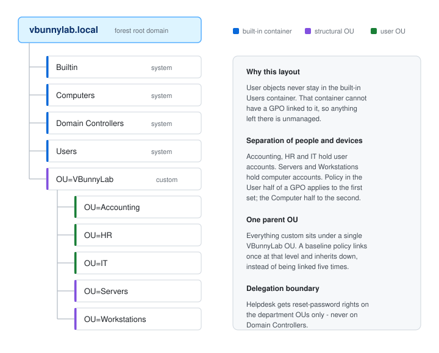
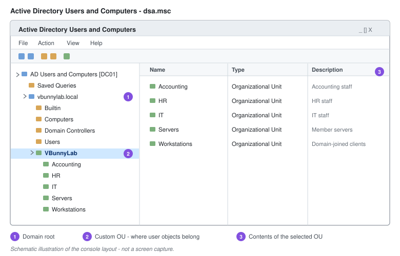

# Active Directory

Active Directory Domain Services is the identity store for a Windows environment. It holds the users, groups and computers, authenticates them, and decides what they can reach.

That makes it the single highest-value target in most networks. An attacker who reaches Domain Admin does not need any further exploit - they have legitimate credentials for everything. Most of the operational habits in this document exist for that reason.



---

## Lab Environment

| Item | Value |
| --- | --- |
| Forest / domain | `vbunnylab.local` |
| Domain controller | `DC01` - `10.10.10.10` |
| Functional level | Windows Server 2016 or higher |
| Domain admin | `vampiricbunny` |
| Standard user | `vbunny` |

---

## Installing AD DS and Promoting a Domain Controller

Set a static IP address before starting. A domain controller must be reachable at a fixed address, and it should point at itself for DNS.

### Install the Role

1. **Server Manager** → **Manage** → **Add Roles and Features**.
2. **Next** past *Before you begin*.
3. **Role-based or feature-based installation** → **Next**.
4. Select the server → **Next**.
5. Tick **Active Directory Domain Services** → **Add Features** → **Next**.
6. **Next** through Features and the AD DS notes → **Install**.

### Promote to Domain Controller

1. Click the **notification flag** → **Promote this server to a domain controller**.
2. **Add a new forest** → Root domain name: `vbunnylab.local`.
3. Set the forest and domain functional levels.
4. Leave **DNS server** and **Global Catalog** ticked.
5. Set the **DSRM password** - this is the Directory Services Restore Mode password, used to boot the DC into recovery. Store it somewhere you will still have access to when the DC is down. It is not the domain admin password.
6. **Next** through NetBIOS name and paths.
7. Review the prerequisites check → **Install**. The server reboots.

Or in PowerShell:

```powershell
Install-WindowsFeature AD-Domain-Services -IncludeManagementTools
Install-ADDSForest -DomainName 'vbunnylab.local' -InstallDns
```

> **On `.local`:** fine for a lab. For production, use a subdomain of a domain you own - `ad.example.com`. The `.local` suffix collides with mDNS/Bonjour and causes intermittent resolution problems on macOS and Linux clients.

---

## Organisational Units

An OU is an administrative container. It exists for two things: linking Group Policy, and delegating rights. Any structure that does not serve one of those is decoration.

### Why User Objects Never Stay in `CN=Users`

The built-in **Users** and **Computers** containers are not OUs - **you cannot link a GPO to them**. Anything left there receives only domain-level policy and cannot be managed as a group. Moving objects into real OUs is the first structural task after promotion.

Redirect the default location so newly joined machines land somewhere manageable:

```cmd
redircmp "OU=Workstations,OU=VBunnyLab,DC=vbunnylab,DC=local"
redirusr "OU=VBunnyLab,DC=vbunnylab,DC=local"
```

### Creating an OU

1. Open **Active Directory Users and Computers** (`dsa.msc`).
2. Right-click the domain or a parent OU → **New** → **Organizational Unit**.
3. Name it and leave **Protect container from accidental deletion** ticked.

```powershell
New-ADOrganizationalUnit -Name 'VBunnyLab' -Path 'DC=vbunnylab,DC=local'
'Accounting','HR','IT','Servers','Workstations' | ForEach-Object {
    New-ADOrganizationalUnit -Name $_ -Path 'OU=VBunnyLab,DC=vbunnylab,DC=local'
}
```

> **Accidental deletion protection** is on by default and worth leaving on. It is also why a delete sometimes fails with access denied even as Domain Admin - clear the checkbox on the **Object** tab (visible only with **Advanced Features** enabled) before deleting deliberately.

---



---

## Users

### Creating an Account

1. Right-click the target OU → **New** → **User**.
2. Fill in first name, last name, and **User logon name** (the UPN).
3. Set a temporary password and tick **User must change password at next logon**.
4. **Next** → **Finish**.

```powershell
New-ADUser -Name 'Barry Allen' -GivenName 'Barry' -Surname 'Allen' `
  -SamAccountName 'ballen' -UserPrincipalName 'ballen@vbunnylab.local' `
  -Path 'OU=IT,OU=VBunnyLab,DC=vbunnylab,DC=local' `
  -AccountPassword (Read-Host -AsSecureString 'Temp password') `
  -ChangePasswordAtLogon $true -Enabled $true
```

Prompting with `Read-Host -AsSecureString` keeps the password out of the console history and out of any transcript log - worth the habit even in a lab.

### Copying an Account

Copying an existing user carries over group memberships, the OU, and most account options. It is quick, and it is how inconsistent permissions spread: the template picks up an extra group once and every copy inherits it.

Keep a deliberately maintained **template account** per role, disabled, and copy from that rather than from a live colleague.

1. Right-click the template → **Copy**.
2. Enter the new name and logon name → **Next**.
3. Set the password → **Next** → **Finish**.
4. Check **Member Of** and confirm the memberships are what the role needs.

### Resetting a Password

1. Find the user - right-click the domain → **Find**, scope **Entire Directory**.
2. Right-click the user → **Reset Password**.
3. Enter the new password, tick **User must change password at next logon**, and tick **Unlock the user's account** if it is locked.

```powershell
Set-ADAccountPassword -Identity ballen -Reset `
  -NewPassword (Read-Host -AsSecureString 'New password')
Set-ADUser -Identity ballen -ChangePasswordAtLogon $true
```

> **Verify identity before resetting.** A password reset request from someone who is not the account owner is one of the oldest and most reliable social-engineering routes into a network. Confirm through a channel the caller did not choose.

### Unlocking an Account

Lockout is not the same as a disabled account or an expired password.

1. Open the user's **Properties** → **Account** tab.
2. Tick **Unlock account** → **Apply**.

```powershell
Unlock-ADAccount -Identity ballen
Search-ADAccount -LockedOut | Select-Object Name, SamAccountName, LastLogonDate
```

Find *why* it locked before unlocking repeatedly - a cached credential on a phone or a service running as the user will lock it again within minutes. Event ID **4740** on the PDC emulator records the source machine.

### Disabling, Expiry and Offboarding

**Disable, don't delete.** A deleted account takes its SID with it, and with it the file permissions and mailbox links that referenced it.

```powershell
Disable-ADAccount -Identity ballen
Set-ADUser -Identity ballen -AccountExpirationDate '2026-12-31'
Set-ADUser -Identity ballen -Description 'Offboarded 2026-09-20 - ticket INC0042'
```

An offboarding sequence that holds up later: disable the account, reset the password, revoke sessions and tokens, move it to a disabled-accounts OU, remove group memberships after recording them, then delete only after the retention period.

**Account expiry** is the right control for contractors, interns and vendors - set the end date at creation and the account closes itself. For permanent staff, *never* is normal; the expiry control is not a substitute for offboarding.

### Finding Objects

1. Right-click the domain → **Find**.
2. Set the object type and scope to **Entire Directory**.
3. Enter the name or description → **Find Now**.

```powershell
Get-ADUser -Filter "Name -like '*allen*'" -Properties Department, LastLogonDate
Search-ADAccount -AccountDisabled
Search-ADAccount -AccountInactive -TimeSpan 90.00:00:00
```

That last one - accounts unused for 90 days - is a standing audit item. Dormant enabled accounts are a common foothold.

---

## Groups

### Scope

| Scope | Can contain | Can grant access to |
| --- | --- | --- |
| **Global** | Accounts from the same domain | Resources in any domain in the forest |
| **Domain Local** | Accounts and groups from any domain in the forest, or trusted domains | Resources in its own domain only |
| **Universal** | Accounts and groups from any domain in the forest | Resources in any domain; replicated to every global catalog |

### Type

- **Security** - carries permissions. Use this for access control.
- **Distribution** - email lists only. Cannot be used to assign permissions.

### AGDLP

The nesting convention that keeps permissions maintainable:

**A**ccounts go into **G**lobal groups → global groups go into **D**omain **L**ocal groups → domain local groups receive the **P**ermission.

In practice: `ballen` → `GG-Accounting-Staff` → `DL-Accounting-Share-Modify` → Modify on the Accounting folder.

It looks like an extra step. What it buys is that permissions are set once on the resource and never touched again - access changes become group membership changes. When permissions are assigned to individuals directly, nobody can answer "who can reach this folder" a year later without reading every ACL.

### Creating a Group

1. Right-click the OU → **New** → **Group**.
2. Name it, choose **Global** and **Security**.
3. **OK**, then **Properties** → **Members** → **Add**.

```powershell
New-ADGroup -Name 'GG-Accounting-Staff' -GroupScope Global -GroupCategory Security `
  -Path 'OU=Accounting,OU=VBunnyLab,DC=vbunnylab,DC=local'

Add-ADGroupMember -Identity 'GG-Accounting-Staff' -Members ballen
Get-ADGroupMember -Identity 'GG-Accounting-Staff' | Select-Object Name, SamAccountName
Get-ADPrincipalGroupMembership -Identity ballen | Select-Object Name
```

---

## The AD Recycle Bin

Enable it before you need it. It cannot recover anything deleted before it was turned on, and once enabled it cannot be turned off.

1. Open **Active Directory Administrative Center** (`dsac.exe`).
2. Select the domain → **Enable Recycle Bin** in the Tasks pane → **OK**.
3. Refresh. A **Deleted Objects** container appears.

```powershell
Enable-ADOptionalFeature -Identity 'Recycle Bin Feature' `
  -Scope ForestOrConfigurationSet -Target 'vbunnylab.local'

Get-ADObject -Filter 'isDeleted -eq $true' -IncludeDeletedObjects |
    Select-Object Name, LastKnownParent

Get-ADObject -Filter "samAccountName -eq 'ballen'" -IncludeDeletedObjects |
    Restore-ADObject
```

Without it, a deleted object becomes a tombstone that loses most of its attributes - recovery means an authoritative restore from backup.

---

## Attribute Editor

Exposes every LDAP attribute on an object, including ones with no GUI field.

1. **View** → **Advanced Features** in ADUC.
2. Right-click the object → **Properties** → **Attribute Editor**.

Worth knowing: `lastLogonTimestamp` (replicated, accurate to within 14 days - use it for dormancy reporting), `lastLogon` (exact but per-DC and not replicated), `pwdLastSet`, `badPwdCount`, `memberOf`, and `objectSID`.

---

## Computer Objects

Joining a domain creates a computer object with its own account and password, rotated automatically every 30 days.

```powershell
Get-ADComputer -Filter * -Properties OperatingSystem, LastLogonDate |
    Select-Object Name, OperatingSystem, LastLogonDate | Sort-Object LastLogonDate
```

Manage a machine remotely from ADUC by right-clicking it → **Manage**, which opens Computer Management against that host. Remote Desktop uses **TCP 3389**.

> **A computer in a group gets that group's policy?** Not quite - that is a common misconception. GPOs apply based on the OU an object sits in, not on group membership. Groups affect policy only through **security filtering**, which controls *whether* a linked GPO applies. Moving a computer to an OU is what changes which GPOs it processes.

Stale computer objects accumulate and should be cleaned up on a schedule - each one is an account that still exists in the directory.

---

## Troubleshooting

| Symptom | Where to look |
| --- | --- |
| Cannot log on, "no logon servers available" | DNS. Client must resolve `_ldap._tcp.dc._msdcs.vbunnylab.local` |
| "Trust relationship between this workstation and the primary domain failed" | Computer account password out of sync - `Test-ComputerSecureChannel -Repair` |
| Account keeps locking | Event **4740** on the PDC emulator identifies the source machine |
| Group membership change has no effect | Kerberos ticket still holds the old groups - log off and back on |
| Object deleted by accident | Recycle Bin if enabled; otherwise authoritative restore |
| Replication problems | `repadmin /replsummary`, `dcdiag /v` |

```powershell
Test-ComputerSecureChannel -Repair -Credential (Get-Credential)
nltest /dsgetdc:vbunnylab.local
```

---

## Security Notes

- **Separate admin accounts from daily accounts.** `vampiricbunny` administers; `vbunny` reads email. A domain admin credential used on a workstation leaves material in memory that can be harvested.
- **Keep privileged groups small.** Audit **Domain Admins**, **Enterprise Admins** and **Schema Admins** regularly. Enterprise and Schema Admins should normally be empty outside of a change window.

  ```powershell
  Get-ADGroupMember 'Domain Admins' | Select-Object Name, SamAccountName
  ```

- **Never browse or read mail from a domain controller.**
- **Delegate instead of promoting.** Helpdesk needs reset-password rights on department OUs, not Domain Admin. Use the Delegation of Control wizard, scoped to the OU.
- **Protect the KRBTGT account.** Its hash signs every Kerberos ticket; a stolen one enables Golden Ticket forgery. Rotate it twice, with replication complete between rotations.
- **Watch for Kerberoasting exposure.** Service accounts with SPNs can have their tickets requested by any authenticated user and cracked offline. Use group Managed Service Accounts (gMSA) where possible.

  ```powershell
  Get-ADUser -Filter {ServicePrincipalName -like '*'} -Properties ServicePrincipalName
  ```

- **Audit the interesting events**: 4720 (account created), 4728/4732 (added to a privileged group), 4740 (lockout), 4625 (failed logon), 4768/4769 (Kerberos ticket requests).
- **Back up system state on a domain controller**, and test the restore. A backup nobody has restored is an assumption.
