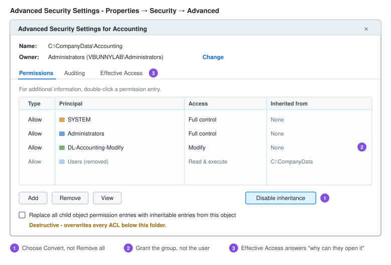

# File Sharing and NTFS Permissions

Reference for SMB shares and the NTFS permission model - how inheritance actually propagates, the order permissions are evaluated in, and the tools that answer "why can this person open this file."

For the step-by-step departmental file server build, see [File Server and Permissions](../Windows-Server-2025/File-Server-and-Permissions.md). This document is the reference behind it.

---

## Creating Shares

Four routes to the same result.

### File Explorer

Right-click the folder → **Properties** → **Sharing** → **Advanced Sharing** → tick **Share this folder** → **Permissions**.

### Server Manager

**File and Storage Services** → **Shares** → **Tasks** → **New Share** → **SMB Share - Quick**.

The Quick profile walks through location, share name, settings and permissions. **SMB Share - Advanced** adds quotas and file classification, and requires the File Server Resource Manager role.

### PowerShell

```powershell
New-SmbShare -Name 'Departments' -Path 'D:\Departments' `
  -FullAccess 'VBUNNYLAB\Authenticated Users' `
  -FolderEnumerationMode AccessBased

Get-SmbShare
Get-SmbShareAccess -Name 'Departments'
Grant-SmbShareAccess -Name 'Departments' -AccountName 'VBUNNYLAB\Domain Admins' -AccessRight Full -Force
Revoke-SmbShareAccess -Name 'Departments' -AccountName 'Everyone' -Force
Remove-SmbShare -Name 'Departments' -Force
```

### net share

```cmd
net share Departments=D:\Departments /GRANT:"Authenticated Users",FULL
net share
net share Departments /DELETE
```

---

## Share Types

| Type | Example | Notes |
| --- | --- | --- |
| Standard | `\\FILE01\Departments` | Visible when browsing |
| Hidden | `\\FILE01\Departments$` | Trailing `$` hides it from browsing. **Not a security control** - anyone who knows the name can connect |
| Administrative | `\\FILE01\C$`, `ADMIN$`, `IPC$` | Created automatically, restricted to local administrators |

```powershell
Get-SmbShare | Where-Object Name -like '*$'
```

> **Administrative shares** are how a great deal of lateral movement works - an attacker with local admin credentials on one machine can reach `C$` on every other machine that accepts them. They can be disabled, but doing so breaks a lot of management tooling. The better control is preventing credential reuse: unique local admin passwords via LAPS, and keeping domain admin credentials off workstations.

### Access-Based Enumeration

Hides what the user cannot open rather than showing it and failing on click.

```powershell
Set-SmbShare -Name 'Departments' -FolderEnumerationMode AccessBased
```

Two benefits: fewer "why can't I open this" tickets, and the share stops advertising the organisation's structure to everyone who browses it.

### SMB Encryption

```powershell
Set-SmbShare -Name 'Departments' -EncryptData $true          # per share
Set-SmbServerConfiguration -EncryptData $true -Force          # whole server
```

Encrypts data in transit. Signing (on by default in current releases) prevents tampering and relay attacks; encryption adds confidentiality. There is a throughput cost, so it is usually applied to shares holding sensitive data rather than universally.

---

## NTFS Permissions

### Basic Permissions

| Permission | Grants |
| --- | --- |
| **Read** | Open files, view contents, attributes and permissions |
| **List folder contents** | Traverse and browse structure - folders only |
| **Read & Execute** | Read, plus run executables |
| **Write** | Create files and folders, write data, change attributes |
| **Modify** | Read & Execute + Write + **delete** |
| **Full Control** | Modify + change permissions + take ownership |

**Modify is the correct default for user data.** Full Control lets a user rewrite the ACL and take ownership - meaning they can grant access to others, and nothing will surface it until someone audits.

### Advanced Permissions

Basic permissions are bundles of these 14. **Advanced** → **Show advanced permissions** exposes them:

Traverse folder / execute file · List folder / read data · Read attributes · Read extended attributes · Create files / write data · Create folders / append data · Write attributes · Write extended attributes · Delete subfolders and files · Delete · Read permissions · Change permissions · Take ownership · Synchronize

Useful combinations:

- **Write but not delete** - Create files/write data, without Delete. Users can add and edit, not remove. Suits drop folders and log directories.
- **Traverse without listing** - Traverse folder, without List folder/read data. A user can reach `\Departments\HR\Payroll` if they know the path, but cannot browse to discover it.

---

## Inheritance

By default a child object inherits its parent's ACL. Inherited entries show greyed out in the Security tab and cannot be edited there - they are edited on the parent.

### Disabling Inheritance

**Advanced** → **Disable inheritance**, with two options:

| Option | Effect |
| --- | --- |
| **Convert inherited permissions into explicit permissions** | Keeps the current entries as editable copies. Remove selectively afterwards. |
| **Remove all inherited permissions** | Empties the ACL. Only `SYSTEM` and ownership remain. |

**Convert is almost always the right choice.** Remove-all on a folder you do not own can lock out everyone including yourself, requiring an ownership takeover to recover.



```powershell
$acl = Get-Acl 'D:\Departments\HR'
$acl.SetAccessRuleProtection($true, $true)   # $true,$true = protect, keep copies
Set-Acl -Path 'D:\Departments\HR' -AclObject $acl
```

The second parameter is the one that matters: `$true` preserves the inherited entries as explicit ones, `$false` discards them.

### Propagation

Changing a parent ACL propagates to children that still inherit. Children with inheritance disabled are unaffected - which is how permissions drift apart over time, and why an ACL audit sometimes turns up folders nobody can explain.

To force a reset down a tree:

```powershell
icacls 'D:\Departments' /reset /T /C
```

`/T` recurses, `/C` continues past errors. This re-inherits everything from the parent and discards explicit entries below it - powerful and destructive in equal measure.

---

## Order of Evaluation

Permissions are not simply "Deny always wins." The actual order:

1. **Explicit Deny**
2. **Explicit Allow**
3. **Inherited Deny**
4. **Inherited Allow**

The consequence catches people out: **an explicit Allow on a child overrides an inherited Deny from the parent.** Denying a group at the top of a tree does not guarantee they are denied further down, because an explicit Allow deeper in wins.

Within the same level, Deny beats Allow. Across levels, the closer entry wins.

> **Avoid Deny entries.** They are rarely necessary - if you need one, the group design is usually the real problem. A Deny applied to a broad group that someone later joins produces access failures that are genuinely difficult to trace, because nothing in the folder they cannot open explains why.

### Effective Access

Rather than reasoning about it, ask Windows:

**Properties** → **Security** → **Advanced** → **Effective Access** tab → **Select a user** → **View effective access**.

This resolves every group membership, inheritance path and deny entry into a definitive per-permission answer. It can also model the effect of adding a group before you make the change.

```powershell
(Get-Acl 'D:\Departments\HR').Access |
    Select-Object IdentityReference, FileSystemRights, AccessControlType, IsInherited

icacls 'D:\Departments\HR'
```

In `icacls` output: `(I)` inherited, `(OI)` object inherit, `(CI)` container inherit, `(F)` full, `(M)` modify, `(RX)` read and execute.

---

## Ownership

The owner can always change permissions on an object, regardless of the ACL. This is the recovery path when an ACL has been broken.

**Advanced** → **Owner** → **Change** → select the principal → tick **Replace owner on subcontainers and objects**.

```cmd
takeown /F D:\Departments\HR /R /A
icacls D:\Departments\HR /grant Administrators:F /T
```

`/A` assigns to the Administrators group rather than the running user, which is usually what you want on a server.

> Unexpected ownership changes are worth investigating. Taking ownership is a normal administrative action and also a normal step in privilege escalation - the difference is whether anyone intended it.

---

## Auditing Access

Permissions control access. Auditing records it. Without a SACL, "who opened this file" has no answer.

**1. Enable the audit policy** via Group Policy:

```text
Computer Configuration → Policies → Windows Settings → Security Settings
  → Advanced Audit Policy Configuration → Object Access
      → Audit File System - Success and Failure
```

**2. Set a SACL on the folder:** **Properties** → **Security** → **Advanced** → **Auditing** tab → **Add** → principal `Everyone`, type **All**, permissions to record.

Events land in the Security log:

```powershell
Get-WinEvent -FilterHashtable @{LogName='Security'; ID=4663} -MaxEvents 50 |
    Select-Object TimeCreated, Message
```

| Event | Meaning |
| --- | --- |
| 4656 | Handle to an object requested |
| 4663 | Object accessed - the useful one |
| 4660 | Object deleted |
| 4670 | Permissions changed |

Audit narrowly. Auditing Everything/Everyone on a busy share generates enough volume to bury anything worth seeing and can fill the log within minutes.

---

## Shadow Copies

Point-in-time snapshots that let users recover their own deleted or overwritten files through **Previous Versions**, without a restore request.

**Volume properties** → **Shadow Copies** tab → select the volume → **Enable** → **Settings** for schedule and storage limit.

```powershell
vssadmin list shadows
vssadmin list shadowstorage
```

Two limits worth stating plainly: shadow copies live on the same volume, so they do not survive a disk failure, and ransomware routinely deletes them (`vssadmin delete shadows /all`) before encrypting. They reduce restore requests; they are not a backup.

---

## Home Folders via Active Directory

Automatically map a per-user drive without Group Policy:

**ADUC** → user **Properties** → **Profile** tab → **Home folder** → **Connect** `H:` **To** `\\FILE01\Users$\%username%`

`%username%` expands per user, and the folder is created automatically with that user granted Full Control on it.

```powershell
Set-ADUser -Identity ballen -HomeDrive 'H:' -HomeDirectory '\\FILE01\Users$\ballen'
```

Group Policy Preferences drive maps are the more flexible option for shared departmental drives, because of item-level targeting. Home folders suit per-user private storage.

---

## Troubleshooting

| Symptom | Cause | Check |
| --- | --- | --- |
| Access denied over the network, fine locally | Share permission more restrictive than NTFS | `Get-SmbShareAccess` |
| Access denied locally and remotely | NTFS | Effective Access tab |
| User in the right group, still denied | Token predates the membership | Sign out and back in |
| Some subfolders behave differently | Inheritance broken somewhere | `icacls <path> /T` and look for missing `(I)` |
| Permissions revert after a change | A parent propagation overwrote them | Check whether inheritance is enabled on the child |
| Can open but not delete | Modify not granted, or Delete removed | Advanced permissions |
| Share missing when browsing | Access-based enumeration, or hidden share | `Get-SmbShare` on the server |
| Everyone has access despite the ACL | An `Everyone` or `Users` entry left in place | Review the full ACL, including inherited entries |

```powershell
Test-Path '\\FILE01\Departments\HR'
Get-SmbSession                    # who is currently connected
Get-SmbOpenFile                   # which files are open
Close-SmbOpenFile -FileId <id> -Force
```

```cmd
net use                           :: current mappings on the client
net use Z: /delete
net use Z: \\FILE01\Departments /persistent:yes
```

---

## Practices Worth Keeping

- **Permissions to groups, never to individual users.** Individual ACEs make an access list impossible to produce a year later.
- **Follow AGDLP** - accounts into global groups, global groups into domain local groups, domain local groups on the resource. See [Active Directory](Active-Directory.md).
- **Simple share permissions, real control in NTFS.** One place to look.
- **Never `Everyone - Full Control` on NTFS.** It is common in lab guides and wrong everywhere else.
- **Break inheritance deliberately and document it**, in a folder description or the ticket that prompted it.
- **Keep the tree shallow.** Deep nesting with repeated inheritance breaks becomes unmaintainable quickly.
- **Audit ACLs periodically** - `icacls` output diffed against a known-good baseline surfaces drift that nobody reported.
