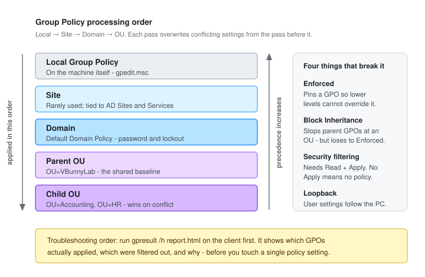
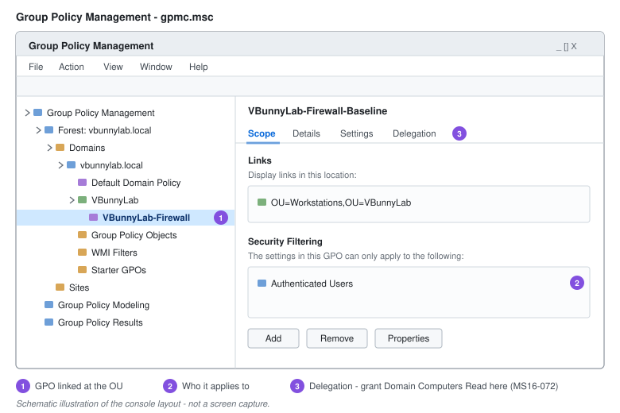

# Group Policy Management

Group Policy is how configuration gets enforced across a domain without touching individual machines. It is also, in practice, the primary mechanism for applying security baselines to Windows - password requirements, lockout thresholds, removable media restrictions, firewall rules, audit policy.

The part that causes the most confusion is not authoring a policy. It's working out why a policy you authored is not applying. That comes down to processing order.



---

## How Processing Works

GPOs apply in a fixed sequence, remembered as **LSDOU**:

1. **L**ocal policy on the machine
2. **S**ite
3. **D**omain
4. **O**U - parent first, then each child OU in turn
5. The **last** setting written wins

So a GPO linked to the child OU closest to the object overrides a conflicting setting from the domain. Precedence runs opposite to processing order: applied last means highest priority.

Where multiple GPOs are linked at the *same* level, **Link Order** decides. Link Order 1 processes last and therefore wins.

### The Four Exceptions

| Exception | Effect |
| --- | --- |
| **Enforced** | Pins a GPO so nothing processed later can override it. Set on the link, not the GPO. |
| **Block Inheritance** | Stops policies from parent containers reaching this OU - but loses to **Enforced**, which always wins. |
| **Security filtering** | A GPO applies only to principals with both **Read** and **Apply group policy**. Remove Apply and the GPO is inert for that object. |
| **Loopback processing** | User-half settings are taken from the *computer's* OU rather than the user's. Used on kiosks, shared terminals and RDS hosts, where policy should follow the machine. |

---

## Policies vs Preferences

Both live in every GPO and they behave very differently.

| | Policies | Preferences |
| --- | --- | --- |
| Enforcement | Enforced - the UI is greyed out | Applied as a default; the user can change it back |
| On GPO removal | Setting reverts | Setting persists, unless *Remove this item when it is no longer applied* is set |
| Typical use | Security controls | Mapped drives, printers, shortcuts, registry values |

If a control must hold, it belongs in Policies. Preferences are conveniences.

---

## Opening the Console

**Server Manager** → **Tools** → **Group Policy Management** → expand **Forest** → **Domains** → `vbunnylab.local`.

To create and link in one step, right-click the target OU → **Create a GPO in this domain, and Link it here**. To create without linking, use the **Group Policy Objects** container and link it later.



> Editing the **Default Domain Policy** directly is a habit worth avoiding. Create a new GPO instead - it keeps changes reversible and makes it obvious who changed what. The exception is the account policy below, which genuinely belongs at the domain level.

---

## Password and Account Lockout Policy

**This is the one that must be set at the domain root.** Password and lockout policy for domain accounts is read from the GPO linked to the *domain*, not from any OU. Link a password policy to `OU=VBunnyLab` and it will appear to apply, report as applied in `gpresult`, and do nothing to domain accounts - it only affects the local SAM of machines in that OU.

1. Edit the GPO linked at the domain level.
2. Navigate to **Computer Configuration** → **Policies** → **Windows Settings** → **Security Settings** → **Account Policies**.

### Password Policy

| Setting | Lab value | Reasoning |
| --- | --- | --- |
| Enforce password history | 24 passwords | Stops cycling straight back to a known password |
| Maximum password age | 365 days, or 0 | Current NIST guidance is against routine expiry - it drives predictable increments. Rotate on evidence of compromise instead |
| Minimum password age | 1 day | Prevents burning through history in one sitting to reuse an old password |
| Minimum password length | 14 characters | Length beats composition |
| Complexity requirements | Enabled | Still worth having alongside length |
| Store passwords using reversible encryption | Disabled | Effectively plaintext storage |

### Account Lockout Policy

| Setting | Lab value | Reasoning |
| --- | --- | --- |
| Account lockout threshold | 10 invalid attempts | Blunts password spraying without locking out typos |
| Account lockout duration | 15 minutes | Auto-clears; avoids a helpdesk queue |
| Reset counter after | 15 minutes | |
| Allow Administrator account lockout | Enabled (Server 2025 / current Windows 11) | Closes the long-standing gap where the built-in Administrator could be sprayed indefinitely |

> **Different rules for different groups?** You cannot do it with a second GPO. Use **Fine-Grained Password Policies** - PSO objects created in Active Directory Administrative Center under **System** → **Password Settings Container**, applied to a group, resolved by precedence value. This is how service accounts or admins get stricter requirements than standard users.

---

## Security Baseline Examples

Each of these is created the same way: right-click the target OU → **Create a GPO in this domain, and Link it here** → name it → right-click → **Edit**.

### Block Removable Storage

Prevents data leaving on a USB stick, and blocks a common malware delivery route.

**Computer Configuration** → **Policies** → **Administrative Templates** → **System** → **Removable Storage Access**

- **All Removable Storage classes: Deny all access** → **Enabled**

For a softer control, set *Removable Disks: Deny write access* instead - read stays available, writing does not.

### Restrict Control Panel

**User Configuration** → **Policies** → **Administrative Templates** → **Control Panel**

- **Prohibit access to Control Panel and PC settings** → **Enabled**

### Standard Desktop Wallpaper

**User Configuration** → **Policies** → **Administrative Templates** → **Desktop** → **Desktop**

- **Desktop Wallpaper** → **Enabled**
- Wallpaper name: a UNC path every user can read, e.g. `\\DC01\NETLOGON\wallpaper.jpg`
- Wallpaper style: **Fill**

Use NETLOGON or a read-only share - a local path only works if the file exists on every machine.

### Mapped Drive (Preference)

**User Configuration** → **Preferences** → **Windows Settings** → **Drive Maps** → right-click → **New** → **Mapped Drive**

- Action: **Update** - creates if missing, refreshes if present, and is safe to reapply
- Location: `\\FILESERVER\Departments\Accounting`
- Drive letter: `E:`
- Use **Item-level targeting** (Common tab) to scope the mapping to the Accounting security group rather than creating a separate GPO per department.

---

## Applying and Refreshing

Policy refreshes automatically every 90 minutes on clients, plus a random offset of up to 30 minutes; domain controllers refresh every 5. Computer policy also applies at boot, user policy at logon.

To force it:

```powershell
gpupdate /force
```

Some settings - drive maps, folder redirection, software installation - only take effect at logon or boot:

```powershell
gpupdate /force /logoff
gpupdate /force /boot
```

---

## Troubleshooting

Always start on the client, with what actually applied. Guessing from the console wastes time.

```powershell
gpresult /r                              # summary for user and computer
gpresult /h C:\gpreport.html /f          # full HTML report, overwrite if present
gpresult /scope computer /v              # verbose, computer half only
```

The HTML report is the useful one. It lists applied GPOs, **denied** GPOs, and the reason for each denial - which is usually the answer.

Work through the causes in this order:

| Symptom | Likely cause |
| --- | --- |
| GPO not listed at all | Link is disabled, or the object is not in the linked OU |
| Listed under **Denied - Access Denied (Security Filtering)** | Missing **Apply group policy** for that principal |
| Listed but a setting did not take | Another GPO with higher precedence overrides it; check **Group Policy Results** in the console |
| Nothing from the parent OU applies | **Block Inheritance** on the child OU |
| A setting cannot be overridden | An **Enforced** link higher up |
| Password policy ignored | Linked to an OU instead of the domain root - see above |
| User settings look wrong on a shared machine | **Loopback processing** is enabled, intentionally or not |
| Nothing applies anywhere | DNS. The client must resolve the domain's SRV records to find a DC |

Model the outcome before deploying with **Group Policy Modeling**, and inspect what a live object actually received with **Group Policy Results** - both in the Group Policy Management console.

```powershell
Get-GPO -All | Select-Object DisplayName, GpoStatus, ModificationTime
Get-GPOReport -Name 'Password Policy' -ReportType Html -Path C:\gpo.html
Get-GPInheritance -Target 'OU=Accounting,OU=VBunnyLab,DC=vbunnylab,DC=local'
```

---

## Operational Notes

- **Back up GPOs before editing.** `Backup-GPO -All -Path D:\GPOBackups` takes a minute and has saved entire afternoons.
- **Name GPOs so the link is obvious** - `VBunnyLab-Workstations-USB-Restriction` beats `New Group Policy Object`.
- **Fewer, broader GPOs process faster** than many narrow ones. Every linked GPO adds to logon time.
- **Disable the unused half.** A GPO with only computer settings should have its user configuration disabled in **Details** → **GPO Status**.
- **Comment the GPO.** The Comment field on a GPO is the only place the reason survives after everyone who set it has moved on.
